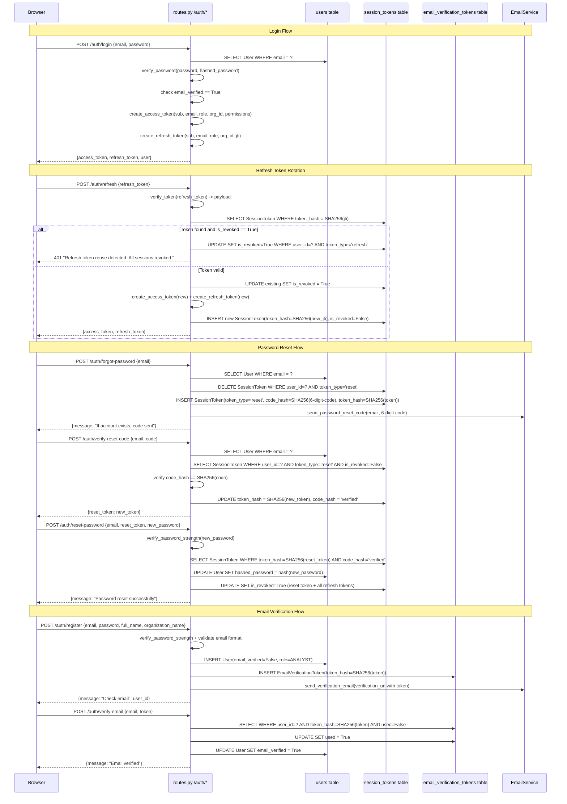
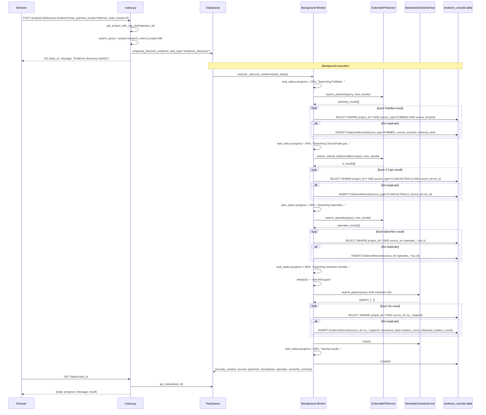
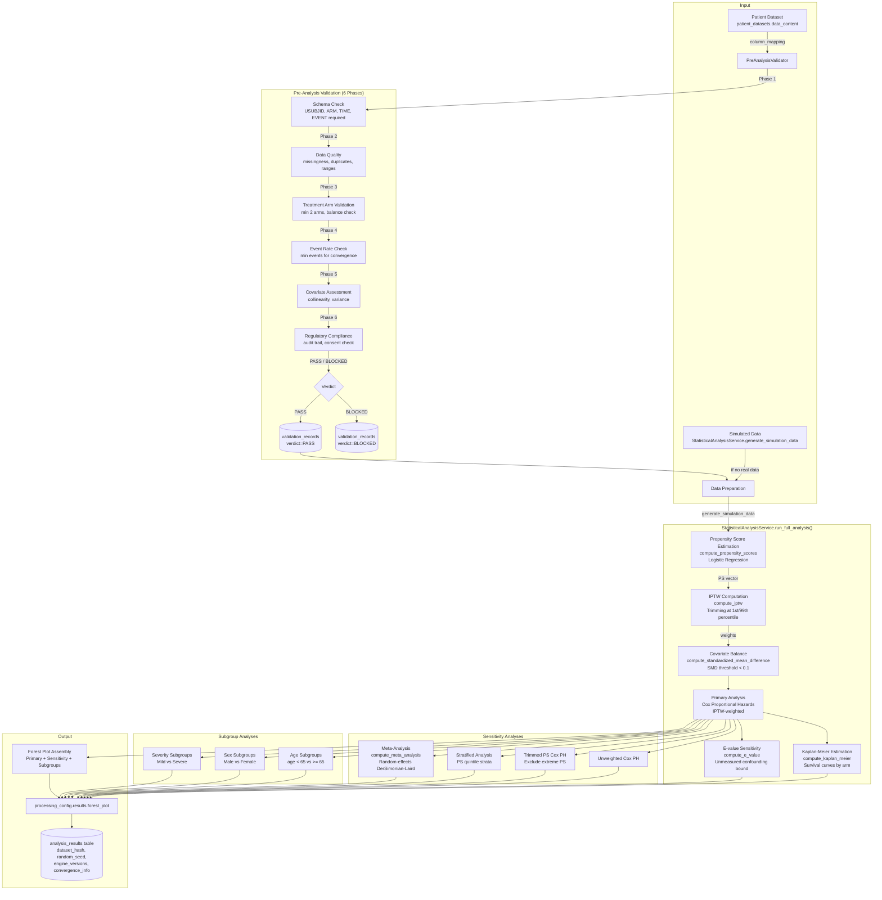
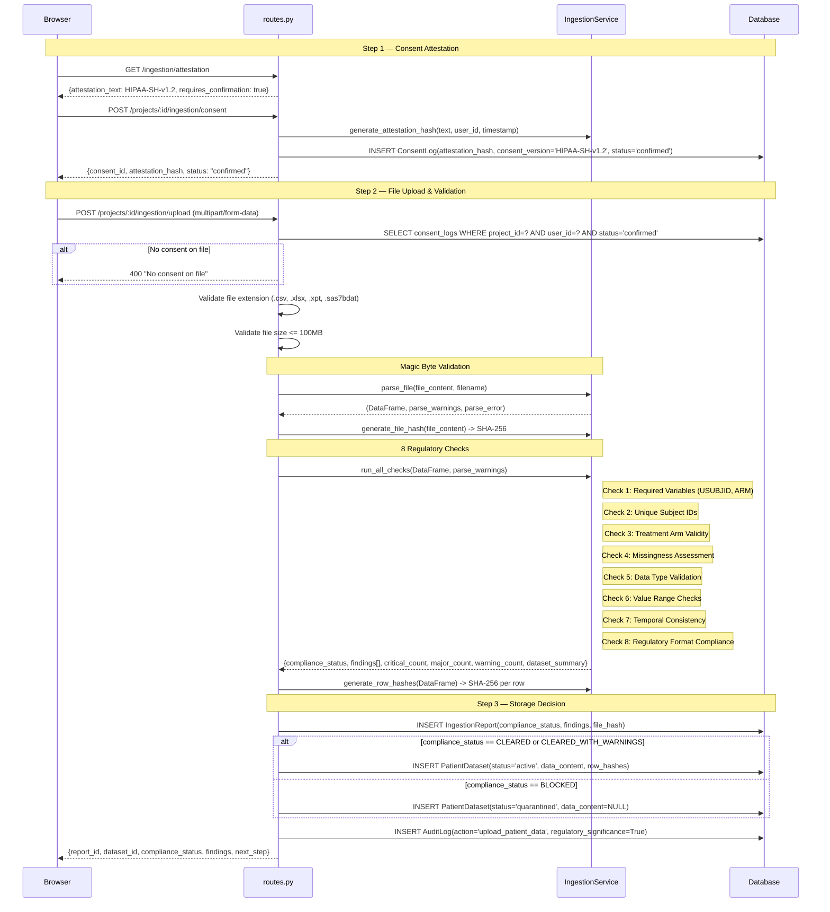
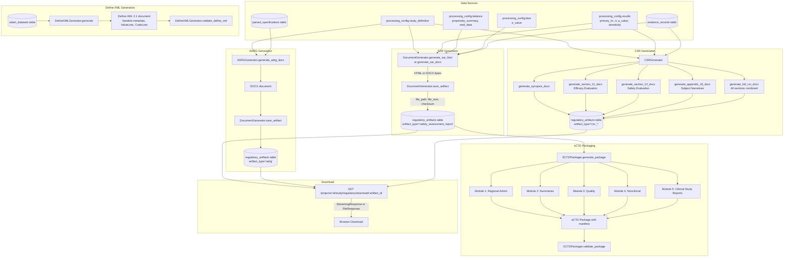
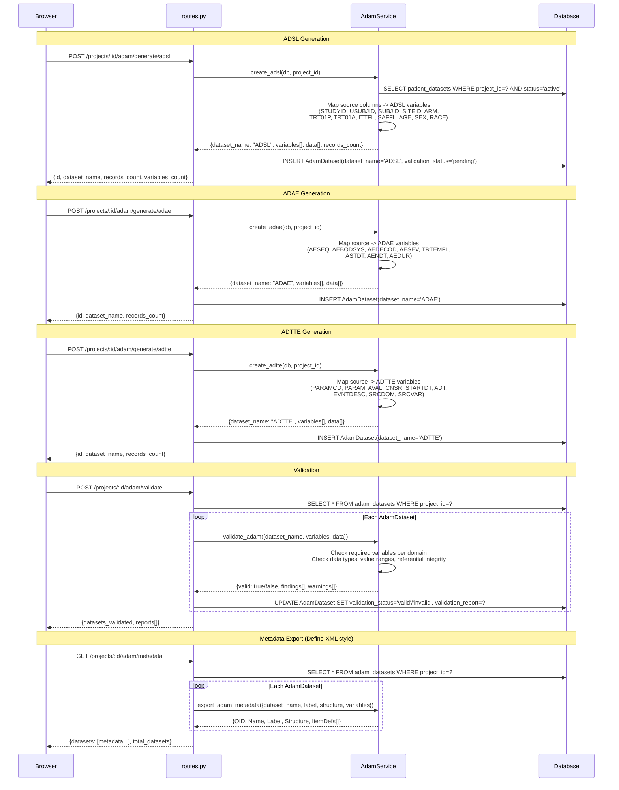
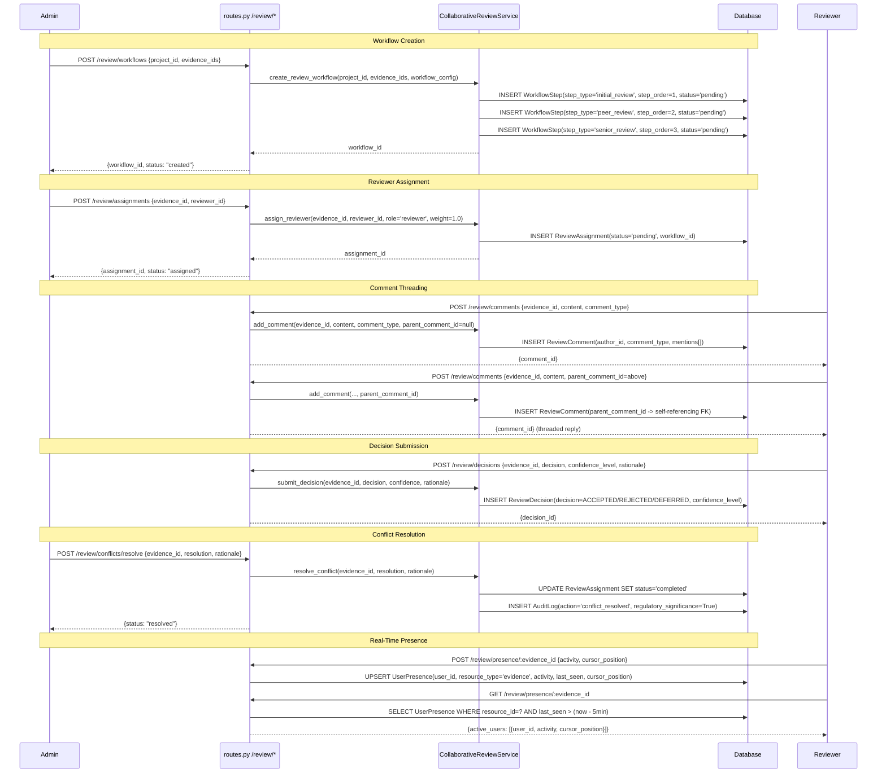

# Afarensis Enterprise v2.1 — Data Flow Diagrams

## Document Control

| Field | Value |
|-------|-------|
| Version | 2.1.0 |
| Date | 2026-03-24 |
| Format | Mermaid (render with any Mermaid-compatible viewer) |

---

## 1. End-to-End System Data Flow

```mermaid
flowchart TD
    A[User Browser] -->|POST /auth/login| B[Auth Module]
    B -->|JWT access_token + refresh_token| A
    A -->|POST /projects| C[ProjectService]
    C -->|INSERT Project| D[(projects table)]
    A -->|PUT /projects/:id/study/definition| E[Study Workflow]
    E -->|UPDATE processing_config.study_definition| D
    A -->|POST /projects/:id/discover-evidence| F[TaskQueue]
    F -->|Background worker| G[ExternalAPIService]
    G -->|E-Utils API| H[PubMed]
    G -->|v2 API| I[ClinicalTrials.gov]
    G -->|REST API| J[OpenAlex]
    G -->|Graph API| K[Semantic Scholar]
    G -->|INSERT EvidenceRecord| L[(evidence_records table)]
    A -->|POST /projects/:id/study/balance/compute| M[StatisticalAnalysisService]
    M -->|compute_propensity_scores + compute_iptw + compute_smd| N[processing_config.balance]
    A -->|GET /projects/:id/study/results/forest-plot| O[routes.py]
    O -->|run_full_analysis| M
    M -->|Cox PH + KM + E-value + subgroup analyses| P[processing_config.results]
    O -->|Forest Plot JSON| A
    A -->|POST /projects/:id/study/regulatory/generate| Q[DocumentGenerator]
    Q -->|READ processing_config.results + evidence_records| P
    Q -->|generate_sar_html / generate_sar_docx| R[(regulatory_artifacts table)]
    R -->|GET .../regulatory/download/:artifact_id| A
    A -->|POST /submission/ectd/generate| S[ECTDPackager]
    S -->|generate_package| T[eCTD Module 5 Package]
    A -->|POST /projects/:id/adam/generate/adsl| U[AdamService]
    U -->|create_adsl / create_adae / create_adtte| V[(adam_datasets table)]
    A -->|POST /projects/:id/ingestion/upload| W[IngestionService]
    W -->|run_all_checks 8 regulatory checks| X[IngestionReport]
    X -->|CLEARED| Y[(patient_datasets table)]
    X -->|BLOCKED| Z[(patient_datasets quarantined)]
    A -->|POST /projects/:id/study/analyze-dataset| AA[PreAnalysisValidator + StatisticalAnalysisService]
    AA -->|6-phase validation + full analysis| AB[(analysis_results table)]
    AB -->|UPDATE processing_config| D
```



---

## 2. Authentication Flow



---

## 3. Evidence Discovery Flow



---

## 4. Statistical Analysis Pipeline



---

## 5. Patient Data Ingestion Flow



---

## 6. Regulatory Document Generation Flow



---

## 7. ADaM Dataset Generation Flow



---

## 8. Collaborative Review Flow



---

## 9. 10-Step Study Workflow

The study workflow stores all state in `projects.processing_config` (a JSON column). Each step reads from and writes to specific keys within this JSON document.

```mermaid
flowchart TD
    subgraph Step1 ["Step 1: Study Definition"]
        S1_IN[User Input] -->|PUT /study/definition| S1[Save study_definition]
        S1 -->|WRITES| S1_OUT[processing_config.study_definition<br/><i>protocol, indication, primary_endpoint,<br/>secondary_endpoints, statistical_method, estimand</i>]
    end

    subgraph Step2 ["Step 2: Protocol Lock"]
        S1_OUT -->|READS study_definition| S2[PUT /study/lock]
        S2 -->|WRITES| S2_OUT[processing_config.protocol_locked = true<br/>processing_config.protocol_locked_at<br/>processing_config.protocol_locked_by]
        S2 -->|INSERT| S2_AUD[(audit_logs: protocol_locked)]
    end

    subgraph Step3 ["Step 3: Covariates"]
        S2_OUT -->|READS protocol_locked| S3[PUT /study/covariates]
        S3 -->|WRITES| S3_OUT[processing_config.covariates<br/><i>covariate names, types, categories</i>]
    end

    subgraph Step4 ["Step 4: Data Sources"]
        S3_OUT --> S4[PUT /study/data-sources]
        S4 -->|WRITES| S4_OUT[processing_config.data_sources<br/><i>source databases, registries, RWD feeds</i>]
    end

    subgraph Step5 ["Step 5: Cohort Definition"]
        S3_OUT & S4_OUT --> S5[PUT /study/cohort]
        S5 -->|WRITES| S5_OUT[processing_config.cohort<br/><i>inclusion_criteria, exclusion_criteria,<br/>index_date_definition, washout_period</i>]
    end

    subgraph Step6 ["Step 6: Cohort Run"]
        S5_OUT -->|READS cohort + data_sources| S6[POST /study/cohort/run]
        S6 -->|WRITES| S6_OUT[processing_config.cohort_result<br/><i>total_screened, total_eligible,<br/>by_arm counts, attrition_table</i>]
    end

    subgraph Step7 ["Step 7: Balance Computation"]
        S3_OUT & S6_OUT -->|READS covariates + cohort_result| S7[POST /study/balance/compute]
        S7 -->|StatisticalAnalysisService| S7_PS[compute_propensity_scores]
        S7_PS --> S7_IPTW[compute_iptw]
        S7_IPTW --> S7_SMD[compute_standardized_mean_difference]
        S7_SMD -->|WRITES| S7_OUT[processing_config.balance<br/><i>smd_data[], propensity_summary{<br/>c_statistic, mean_ps_treated,<br/>mean_ps_control, n_trimmed}</i>]
    end

    subgraph Step8 ["Step 8: Results / Forest Plot"]
        S7_OUT -->|READS balance| S8[GET /study/results/forest-plot]
        S8 -->|run_full_analysis| S8_ANA[Cox PH + KM + E-value + Subgroups]
        S8_ANA -->|WRITES| S8_OUT[processing_config.results<br/><i>forest_plot[], primary_hr,<br/>ci_lower, ci_upper, p_value,<br/>sensitivity[], subgroup[]</i>]
    end

    subgraph Step9 ["Step 9: Bias Assessment"]
        S8_OUT -->|READS results| S9[POST /study/bias/run or GET /study/bias]
        S9 -->|WRITES| S9_OUT[processing_config.bias<br/><i>e_value{point, ci_lower},<br/>bias_domains[], risk_of_bias,<br/>interpretation</i>]
    end

    subgraph Step10 ["Step 10: Regulatory Generation"]
        S1_OUT & S7_OUT & S8_OUT & S9_OUT -->|READS all sections| S10[POST /study/regulatory/generate]
        S10 -->|DocumentGenerator| S10_DOC[SAR HTML/DOCX]
        S10_DOC -->|INSERT| S10_OUT[(regulatory_artifacts table)]
        S10_OUT -->|GET .../download/:id| S10_DL[Browser Download]
    end

    subgraph Reproducibility ["Reproducibility & Audit"]
        S8_OUT -->|GET /study/reproducibility| REPRO[processing_config.reproducibility<br/><i>random_seed, software_version, lock_hash</i>]
        S2_AUD --> AUDIT[GET /study/audit<br/>Full audit trail from audit_logs]
    end

    style Step1 fill:#e1f5fe
    style Step2 fill:#e1f5fe
    style Step3 fill:#e8f5e9
    style Step4 fill:#e8f5e9
    style Step5 fill:#e8f5e9
    style Step6 fill:#fff3e0
    style Step7 fill:#fff3e0
    style Step8 fill:#fce4ec
    style Step9 fill:#fce4ec
    style Step10 fill:#f3e5f5
```

### processing_config Key Reference

| Step | Endpoint | Key Written | Key(s) Read |
|------|----------|-------------|-------------|
| 1 | `PUT /study/definition` | `study_definition` | -- |
| 2 | `PUT /study/lock` | `protocol_locked`, `protocol_locked_at`, `protocol_locked_by` | `study_definition` |
| 3 | `PUT /study/covariates` | `covariates` | `protocol_locked` |
| 4 | `PUT /study/data-sources` | `data_sources` | -- |
| 5 | `PUT /study/cohort` | `cohort` | `covariates`, `data_sources` |
| 6 | `POST /study/cohort/run` | `cohort_result` | `cohort`, `data_sources` |
| 7 | `POST /study/balance/compute` | `balance` | `covariates` |
| 8 | `GET /study/results/forest-plot` | `results` | `balance` |
| 9 | `POST /study/bias/run` | `bias` | `results` |
| 10 | `POST /study/regulatory/generate` | *(regulatory_artifacts table)* | `study_definition`, `covariates`, `cohort`, `balance`, `results`, `bias` |
