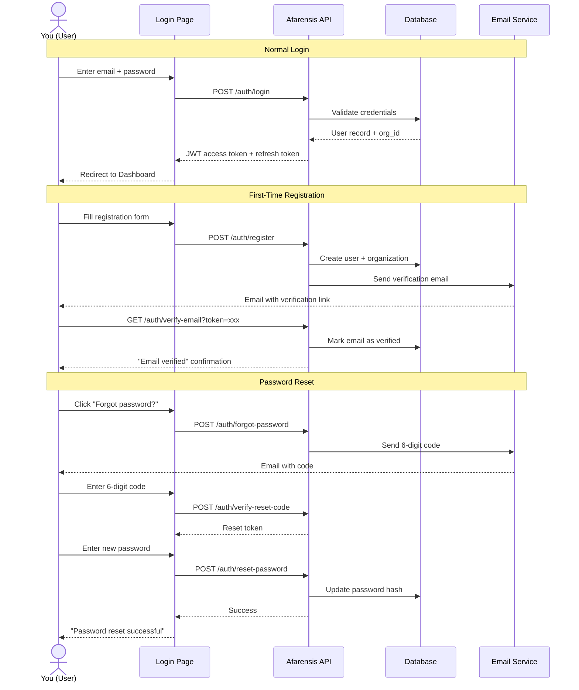
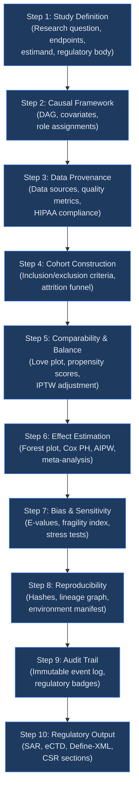
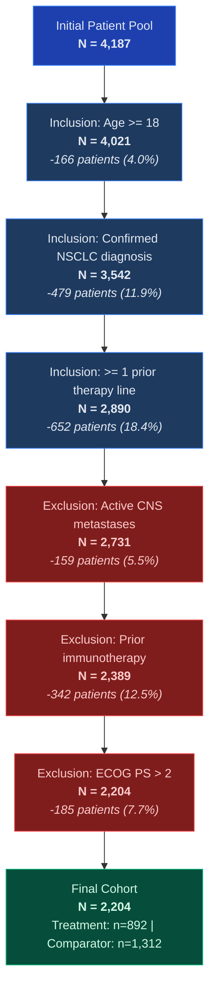
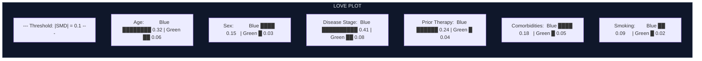
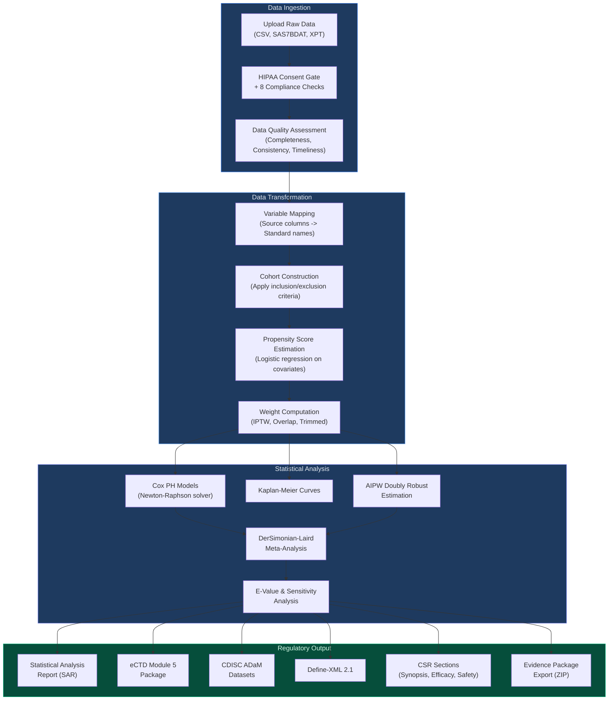
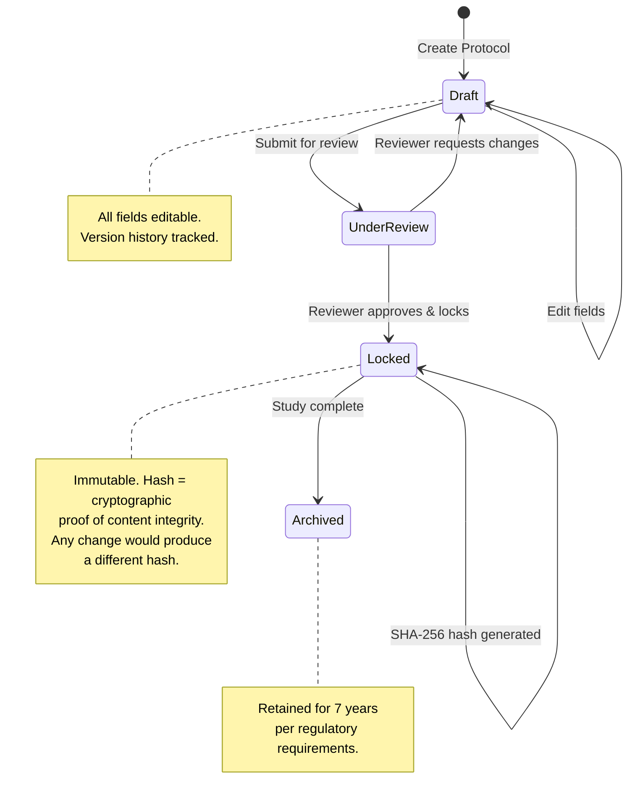
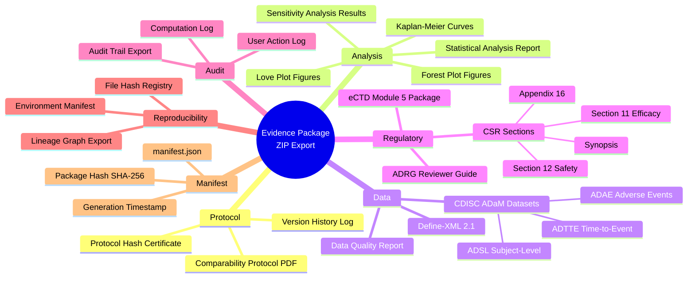

# Afarensis Enterprise v2.2 --- Product Guide

## Document Control

| Field   | Value           |
|---------|-----------------|
| Version | 2.2.0           |
| Date    | 2026-03-25      |
| Status  | Current Release |

---

## Table of Contents

1. [What is Afarensis?](#1-what-is-afarensis)
2. [Getting Started](#2-getting-started)
3. [The 10-Step Workflow](#3-the-10-step-workflow)
4. [New in v2.2](#4-new-in-v22--six-artifacts-that-change-everything)
5. [Analysis Lineage Pages](#5-analysis-lineage-pages)
6. [Literature Search](#6-literature-search)
7. [Admin Pages](#7-admin-pages)
8. [Cross-Cutting UX Features](#8-cross-cutting-ux-features)
9. [Data Security and Compliance](#9-data-security-and-compliance)
10. [Quick Start: Your First Analysis in 15 Minutes](#10-quick-start-your-first-analysis-in-15-minutes)
11. [Glossary](#11-glossary)

---

## 1. What is Afarensis?

### The Big Picture

Imagine you are a clinical researcher. You have spent years running a study --- maybe testing whether a new cancer drug extends patients' lives compared to the standard chemotherapy. You have mountains of data: patient records, lab results, treatment histories, survival times. Now comes the hard part. You need to analyze all of that data using the right statistical methods, document everything you did with surgical precision, and package it all up in a format that a regulatory agency like the FDA will actually accept. One mistake --- a misapplied formula, a missing audit entry, an undocumented assumption --- and your submission could be delayed by months or rejected outright.

That is the problem Afarensis Enterprise solves.

Think of Afarensis as a GPS for clinical evidence. Just as a GPS guides you turn by turn from your starting point to your destination, Afarensis guides you step by step from "I have a research question" to "Here is my complete, submission-ready regulatory package." It does not just give you directions --- it also watches the road for you, flagging potholes (data quality issues), checking your mirrors (bias assessments), and keeping a dashcam recording of the entire trip (an immutable audit trail that regulators can inspect years later).

Under the hood, Afarensis is a real statistical analysis platform. It runs Cox proportional hazards models (a way of estimating whether a treatment reduces the risk of death or disease progression), propensity score weighting (a technique for making two patient groups comparable when you cannot randomize them), Kaplan-Meier survival curves (the step-shaped graphs you see in oncology papers), meta-analysis (combining results from multiple approaches), and more. Every computation is validated against the gold-standard R `survival` package and Python `lifelines` library, so you can trust the numbers.

But Afarensis is not just a calculator. It is an entire ecosystem:

- **A study designer** that helps you define your research question, endpoints, and causal framework before you touch a single data point.
- **A data quality watchdog** that checks your data sources for completeness, consistency, and HIPAA compliance.
- **A cohort builder** that lets you define inclusion and exclusion criteria and then shows you exactly how many patients survive each filter.
- **A balance assessor** that tells you whether your treatment and comparator groups are truly comparable --- or whether hidden confounders (lurking variables that distort your results) are throwing things off.
- **A bias quantifier** that measures how robust your findings would be if there were an unmeasured confounder you did not know about.
- **A document generator** that produces regulatory-grade reports, CDISC-compliant datasets, and eCTD submission packages at the push of a button.
- **An audit system** that records every action, every computation, every edit --- creating an unbreakable chain of evidence that satisfies FDA 21 CFR Part 11 and ICH E6(R2) requirements.

And in v2.2, Afarensis adds six powerful new artifacts that take the platform from "analysis tool" to "complete regulatory evidence system." More on those in Section 4.

### Why Does This Matter?

Here is the uncomfortable truth about clinical research today: the gap between "we ran the analysis" and "we can prove to a regulator that we ran the analysis correctly" is enormous. A single observational study might involve dozens of statistical decisions --- which covariates to adjust for, which weighting method to use, how to handle missing data, where to set the caliper for propensity score matching. Each decision needs to be documented, justified, and traceable. Traditionally, this documentation is done manually in Word documents and Excel spreadsheets, often months after the analysis was completed, by people working from memory. The result? Incomplete audit trails, inconsistent documentation, and regulatory submissions that take 6 to 12 months longer than they should.

Afarensis eliminates that gap. Every decision is captured at the moment it is made. Every computation is logged with its inputs, parameters, and outputs. Every document is generated directly from the analysis --- not retyped from memory. The audit trail writes itself.

And with v2.2, the system goes even further: your analysis plan is cryptographically sealed before you see the data, your results are packaged into a single evidence bundle, and every file in that bundle can be independently verified for integrity.

### Who Is This For?

Afarensis is built for biostatisticians, clinical researchers, regulatory affairs professionals, and medical writers who work in pharmaceutical, biotech, or academic research settings. But you do not need to be an expert to use it. If you are a graduate student running your first real-world evidence study, Afarensis will hold your hand through the entire process. If you are a 20-year veteran biostatistician, it will save you weeks of manual documentation work while giving you full transparency into every computation.

The platform is particularly well-suited for:

- **Real-world evidence (RWE) studies** --- where you are using electronic health records, claims databases, or registries instead of randomized trial data.
- **Post-marketing commitments** --- where a drug has already been approved and you need to generate additional evidence from real-world use.
- **Health technology assessments** --- where payers and HTA bodies need structured evidence packages to make reimbursement decisions.
- **Academic comparative effectiveness research** --- where you are comparing treatments using observational data and need to publish in a peer-reviewed journal with full methodological transparency.

### Key Capabilities at a Glance

- **Protocol parsing and study design** --- structured definition of research questions, endpoints, estimands (the precise quantity you are trying to estimate), and regulatory context.
- **Multi-source evidence discovery** --- unified search across PubMed, ClinicalTrials.gov, OpenAlex, and Semantic Scholar.
- **Real statistical analysis engine** --- Cox proportional hazards (Newton-Raphson solver), propensity score estimation, IPTW (Inverse Probability of Treatment Weighting), AIPW (Augmented Inverse Probability Weighting, also called "doubly robust" estimation), Kaplan-Meier survival estimation, E-values (VanderWeele-Ding), DerSimonian-Laird meta-analysis, and stratified subgroup analyses.
- **CDISC ADaM dataset generation** --- produces ADSL (Subject-Level), ADAE (Adverse Events), and ADTTE (Time-to-Event) datasets conforming to CDISC standards.
- **Regulatory document generation** --- SAR (Statistical Analysis Report), eCTD Module 5 packages, Define-XML 2.1, ADRG (Analysis Data Reviewer's Guide), and CSR sections.
- **HIPAA-compliant patient data ingestion** --- consent gate, encrypted upload, and 8 regulatory compliance checks on every data ingestion event.
- **Collaborative multi-reviewer workflows** --- role-based access with Admin, Reviewer, Analyst, and Viewer tiers.
- **Full audit trail with regulatory retention** --- immutable, append-only event log with 7-year retention for regulatory inspection readiness.
- **NEW: Comparability Protocol** --- prespecified, lockable, SHA-256 hashed analysis plans.
- **NEW: Feasibility Assessment Gate** --- 6 automated checks before analysis begins.
- **NEW: Evidence Package Export** --- ZIP bundle with manifest for regulatory submission.
- **NEW: Cryptographic Protocol Hashing** --- tamper-proof verification of analysis specifications.
- **NEW: Audit Trail Export** --- regulatory-grade downloadable audit packages.
- **NEW: Reference Population Library** --- cross-study comparison against historical benchmarks.

---

## 2. Getting Started

### 2.1 Login and Registration

The first thing you will see when you open Afarensis is the login screen --- a clean, split-panel design with trust indicators on the left ("Immutable audit history," "Versioned evidence packages," "CFR Part 11 aligned workflow controls") and the sign-in form on the right.

If you already have an account, just enter your email and password and click "Sign in." If you check "Remember me," Afarensis will save your email for next time.

If you are new, click "Create an account." You will need to provide your full name, email, a strong password (at least 8 characters with uppercase, lowercase, number, and special character --- the form shows you a live strength meter as you type), and your organization name. When you submit, Afarensis creates a new organization with you as its admin and sends a verification email. You must click the link in that email before you can sign in.

Forgot your password? No problem. Click "Forgot password?" and enter your email. You will receive a 6-digit verification code. Enter it on the next screen, then set a new password. The whole flow takes about 60 seconds.

Here is how the login flow works from a technical perspective:

> **What you are looking at:** This sequence diagram shows three scenarios. In the **Normal Login** flow (top), you type your credentials, the API checks them against the database, and you get back a JWT token (a digitally signed pass that proves who you are) that lets you access the rest of the application. In the **Registration** flow (middle), the API creates your user account and organization, then sends you a verification email --- you cannot sign in until you click that link. In the **Password Reset** flow (bottom), a 6-digit code is sent to your email, you enter it to prove you own the account, and then you set a new password. At no point does the system reveal whether an email address exists in the database (this prevents attackers from enumerating valid accounts).

### 2.2 Roles

Once you are in, your experience depends on your role. Think of roles like security clearances --- each one gives you access to different capabilities:

| Role     | What You Can Do |
|----------|-----------------|
| **Admin**    | Everything. You manage users, organizations, system settings, and all projects. You are the boss. |
| **Reviewer** | You can view projects, leave comments, and approve analyses. But you cannot change statistical configurations --- this separation ensures the person checking the work is not the same person doing the work. |
| **Analyst**  | You can create projects, configure analyses, run computations, and generate documents. This is the primary "doer" role. |
| **Viewer**   | Read-only access to projects you have been invited to. You can look, but you cannot touch. Perfect for external auditors or stakeholders who need visibility without edit rights. |

### 2.3 Understanding the Authentication Security Model

Before we move on to the dashboard, it is worth pausing to appreciate the security model behind the login system, because it affects everything you do in Afarensis.

When you log in, the server issues two tokens: an **access token** (short-lived, used for every API request) and a **refresh token** (longer-lived, used to get new access tokens without re-entering your password). The access token is like a day pass --- it expires quickly (typically within minutes to hours, depending on your admin's configuration). The refresh token is like a membership card --- it lasts longer but is more carefully protected.

Here is the clever part: every time the refresh token is used, it is rotated --- the old one is invalidated and a new one is issued. If an attacker intercepts your refresh token and tries to use it, the server will detect that the token was already used (because you already used it to get a new one) and will invalidate all tokens in that family. This means the attacker is locked out, and you will be prompted to log in again. It is a security technique called "refresh token rotation with reuse detection," and it provides strong protection against token theft.

Login attempts are limited to 5 per minute per IP address. This prevents brute-force attacks (where an attacker tries thousands of password combinations). If you exceed 5 attempts, you will need to wait a minute before trying again.

### 2.3 The Dashboard

After logging in, you land on the Dashboard (`/dashboard`) --- your home base. It shows all your projects as a grid of cards, each displaying:

- **Project title** --- the name you gave the project when you created it.
- **Status badge** --- a colored pill that tells you where things stand: Draft (blue), Processing (purple), In Review (amber), Completed (green), or Archived (gray).
- **Creation date** --- when the project was first created.
- **Evidence count** --- how many literature items or data sources are attached.

Across the top of the grid, you will see filter tabs: All, Draft, In Review, Completed, and Archived. Click any tab to narrow the view.

To start a new project, click the "New Project" button. A modal pops up where you enter a title, pick an indication (the disease area --- Oncology, Cardiology, Rare Disease, Neurology, Immunology, Infectious Disease, and so on), and optionally add a description. Hit submit, and Afarensis creates a new project in Draft status and drops you straight into Step 1.

To resume an existing project, just click its card. You will land on whichever step you were last working on.

#### Project Status Lifecycle

Projects move through a natural lifecycle as you work on them:

- **Draft** --- the project has been created but work has not been completed. Most of your time will be spent in this state.
- **Processing** --- the project is actively running computations (for example, generating a large regulatory document or running a complex meta-analysis). You can still navigate the project, but some steps may show loading indicators.
- **In Review** --- the analysis is complete and a Reviewer has been asked to evaluate it. The Reviewer can view all steps, leave comments, and ultimately approve or send the project back for revisions.
- **Completed** --- the analysis has been reviewed and approved. The project is effectively "done" --- all documents have been generated and the study is ready for submission.
- **Archived** --- the project has been moved to long-term storage. It remains accessible (for regulatory audits, for example) but is no longer actively worked on. Archived projects appear in the dashboard only when the "Archived" filter tab is selected.

The status progression is not rigid --- a Completed project can be reopened if new data becomes available, and an In Review project can be sent back to Draft if the Reviewer identifies issues. All status changes are logged in the audit trail.

---

## 3. The 10-Step Workflow

This is the heart of Afarensis. The 10-step workflow is a structured path from research question to regulatory submission. Think of it like a recipe: you can peek ahead at any step, but the ingredients from earlier steps feed into later ones.

The 10-step structure was designed to mirror the logical sequence of a well-conducted observational study, as recommended by the ISPE/ISPOR guidelines for good pharmacoepidemiology practices and the FDA's Framework for Real-World Evidence. Each step addresses a specific scientific question:

1. **What are you studying?** (Study Definition)
2. **What is your causal model?** (Causal Framework)
3. **Where does your data come from?** (Data Provenance)
4. **Who is in your study?** (Cohort Construction)
5. **Are the groups comparable?** (Comparability and Balance)
6. **What is the treatment effect?** (Effect Estimation)
7. **How robust are the findings?** (Bias and Sensitivity)
8. **Can someone else reproduce this?** (Reproducibility)
9. **Is everything documented?** (Audit Trail)
10. **What goes in the submission?** (Regulatory Output)

When you are inside a project, the left sidebar shows all 10 steps as a vertical list. Each step has a status indicator:

- **Gray circle** --- not started (no data entered yet).
- **Amber circle** --- in progress (you have entered some data but have not finished).
- **Green checkmark** --- complete (all required fields and computations are done).

You can click any step to jump to it, but the natural flow is Step 1 through Step 10. Some steps depend on earlier outputs --- for example, Step 5 (Comparability and Balance) needs the covariates you selected in Step 2 and the cohort you built in Step 4.

Here is the complete workflow as a flowchart:

> **What you are looking at:** Each box is one step in the workflow. The arrows show the natural progression --- you start at the top by defining your study and work your way down to producing regulatory outputs at the bottom. The text inside each box summarizes what happens at that step. While you can visit steps in any order by clicking the sidebar, the arrows represent data dependencies: Step 5 uses data from Steps 2 and 4, Step 6 builds on Step 5, and Step 10 pulls from everything above it.

Now let us walk through each step in detail.

---

### Step 1: Study Definition

**Route:** `/projects/:id/study`

This is where everything begins. Before you analyze a single data point, you need to clearly define what you are studying and why. Think of this step as writing the research question on the whiteboard before you start the experiment.

You will fill in the following fields:

- **Protocol name** --- a descriptive title for your study (for example, "KEYNOTE-042 RWE Replication" if you are trying to replicate the results of a landmark cancer immunotherapy trial using real-world data).
- **Indication** --- the disease area. Pick from Oncology, Cardiology, Rare Disease, Neurology, Immunology, Infectious Disease, and others.
- **Primary endpoint** --- what you are measuring. In cancer research, this is usually OS (Overall Survival --- how long patients live), PFS (Progression-Free Survival --- how long until the cancer grows or spreads), or ORR (Overall Response Rate --- what fraction of patients see their tumors shrink). You can also choose DFS (Disease-Free Survival), EFS (Event-Free Survival), or define a custom endpoint.
- **Estimand type** --- this is a precise statistical concept introduced by the ICH E9(R1) guideline. In plain English, it answers the question: "Exactly what treatment effect are we trying to estimate, and for whom?" Your options are:
  - **ATT** (Average Treatment Effect on the Treated) --- what is the effect of the drug specifically among the people who actually received it?
  - **ATE** (Average Treatment Effect) --- what would the effect be if we could give the drug to everyone?
  - **ITT** (Intent-to-Treat) --- what is the effect based on who was assigned to receive the drug, regardless of whether they actually took it?
  - **PP** (Per-Protocol) --- what is the effect among patients who followed the study rules perfectly?
- **Phase** --- Phase II, III, or IV of the clinical development process.
- **Regulatory body** --- which agency will review your submission: FDA, EMA (European Medicines Agency), PMDA (Japan), or Health Canada.
- **Treatment name** --- the drug or intervention you are studying (for example, "Pembrolizumab 200 mg Q3W").
- **Comparator name** --- what you are comparing against (for example, "Platinum-based chemotherapy").
- **Secondary endpoints** --- additional outcomes you want to track beyond the primary endpoint.

Once you are satisfied, you can click the **"Lock Protocol"** button. This freezes everything on this page --- no more edits allowed. Why? Because regulatory submissions require that your analysis plan was decided before you looked at the data (this prevents cherry-picking results). The lock event is permanently recorded in the audit trail, and in v2.2, the locked protocol is also cryptographically hashed (see Section 4).

On the right side of the screen, you will see two panels:
- **Literature Evidence panel** --- shows publications relevant to your protocol, pulled from the project's saved evidence base. As you define your indication and endpoints, the panel automatically surfaces relevant papers you have saved from the Literature Search. This helps you ground your study design in the existing evidence.
- **Show Your Work panel** --- displays computational transparency information, showing the formulas and parameters behind any automated suggestions. For example, if Afarensis suggests a minimum sample size based on your endpoint and expected effect size, the Show Your Work panel shows the power calculation formula, the assumed parameters, and the resulting sample size requirement.

#### The Importance of Protocol Lock

You might wonder: why is locking the protocol so important? Can't you just promise not to change things?

In short: no. The history of clinical research is littered with cases where researchers --- consciously or unconsciously --- adjusted their analysis plan after seeing the data to produce more favorable results. This practice, known as "p-hacking" or "data dredging," is one of the biggest threats to the credibility of clinical evidence.

Regulatory agencies address this problem by requiring prespecification: you must define your analysis plan before looking at the data. The protocol lock in Afarensis provides a technical enforcement of this requirement. Once locked:

- No fields on the Study Definition page can be edited.
- The lock timestamp is recorded in the audit trail.
- In v2.2, a SHA-256 hash of the protocol content is computed (see Section 4.4), providing cryptographic proof that the protocol was not altered after lock.
- All downstream documents reference the locked protocol and its hash.

If you discover mid-analysis that you need to change something --- for example, you realize a covariate you did not include is an important confounder --- you must document the change as a protocol deviation. The original locked protocol remains on record, and the deviation is logged separately. This transparency is what regulators want to see: not perfection, but honesty.

---

### Step 2: Causal Framework

**Route:** `/projects/:id/causal-framework`

Now that you have defined what you are studying, you need to define the causal story --- the set of assumptions about how treatment, outcome, and other variables relate to each other. This is arguably the most important step in any observational study (a study that uses existing data rather than a controlled experiment), because your assumptions determine which statistical adjustments you need to make.

The centerpiece of this step is the **DAG (Directed Acyclic Graph)** --- an interactive diagram that shows causal relationships as arrows between variables. The default structure shows Treatment leading to Outcome, with confounders (variables that affect both treatment assignment and the outcome) branching into both. If that sounds abstract, think of it this way: if older patients are more likely to receive the standard chemotherapy (because doctors prefer the newer drug for younger patients) and older patients also have worse survival, then age is a confounder. If you do not account for it, you might wrongly conclude the new drug is better than it actually is --- or worse than it actually is.

Below the DAG, you will find the **covariate checklist** --- a list of variables you can include in your analysis:

- Age
- Sex
- Baseline severity
- Comorbidities (other diseases the patient has)
- Prior therapy
- Biomarkers (molecular indicators like PD-L1 expression)
- Region
- BMI (Body Mass Index)
- Smoking status
- Disease stage

For each covariate you select, you assign a **role tag** that tells Afarensis how to handle it:

| Role | What It Means (Plain English) |
|------|-------------------------------|
| **Confounder** | This variable affects both who gets treated and what happens to them. You must adjust for it, or your results will be biased. Example: disease severity. |
| **Effect modifier** | This variable changes the size of the treatment effect. The drug might work better in younger patients than older ones. Afarensis uses effect modifiers to run subgroup analyses. |
| **Mediator** | This variable sits on the pathway between treatment and outcome. The drug causes the mediator, and the mediator causes the outcome. Adjusting for it can actually introduce bias (a common mistake). Example: drug adherence. |
| **Precision variable** | This variable predicts the outcome but not treatment assignment. Including it makes your estimates more precise without introducing bias. Example: baseline tumor size when treatment assignment does not depend on tumor size. |

Your selections here feed directly into Step 5 (where Afarensis balances the groups on these covariates) and Step 6 (where it estimates the treatment effect).

#### Why Getting the Causal Framework Right Is Critical

Here is an analogy. Imagine you are trying to figure out whether carrying an umbrella causes rain. You notice that on days when people carry umbrellas, it rains more often. Correlation! But obviously, umbrellas do not cause rain --- the weather forecast (a confounder) causes both umbrella-carrying and rain. If you adjust for the weather forecast, the "umbrella causes rain" effect disappears.

In clinical research, the confounders are subtler and the stakes are higher. If disease severity is a confounder (sicker patients get more aggressive treatment AND sicker patients have worse outcomes) and you fail to adjust for it, you might conclude that the aggressive treatment causes worse outcomes --- when in reality, it is the severity causing both. The DAG in Step 2 is your tool for making these causal assumptions explicit and ensuring you adjust for the right variables in the right way.

A common mistake is adjusting for mediators (variables on the causal pathway). If the treatment improves adherence (a mediator), and adherence improves outcomes, then adjusting for adherence blocks part of the treatment's effect --- making the treatment look less effective than it actually is. The role tags in Afarensis help you avoid this mistake by forcing you to think about each variable's causal role before the analysis begins.

---

### Step 3: Data Provenance

**Route:** `/projects/:id/data-provenance`

"Provenance" is a fancy word for "where did this data come from, and is it any good?" In the art world, provenance tells you who owned a painting and whether it is authentic. In clinical research, data provenance tells you which data sources you are using, how complete they are, and whether they meet regulatory standards.

This step presents your data sources as cards, each showing:

- **Source name** (for example, "Flatiron Health EHR Extract")
- **Source type** (EHR, Claims, Registry, Clinical Trial)
- **Record count** --- how many patient records are available
- **Date range** --- what time period the data covers
- **Coverage score** --- the percentage of required variables that are actually present in this source

For each data source, Afarensis evaluates three quality dimensions:

- **Completeness** --- what percentage of required fields have actual values (as opposed to missing/blank entries)?
- **Consistency** --- do the values make sense together? (For example, Afarensis flags cases where a death date comes before a diagnosis date --- that is clearly an error.)
- **Timeliness** --- how recent is the most current data relative to your analysis date?

There is also a **variable mapping table** --- a two-column layout where you match the column names in your source data to the standardized variable names Afarensis uses internally. The system suggests mappings automatically, but you can override them.

#### Why Data Provenance Matters

In traditional research, data provenance is often an afterthought --- researchers download a dataset, clean it in R or Python, and analyze it, without systematically documenting where the data came from, what quality checks were performed, or how variables were mapped. When a regulatory reviewer asks "Where did this age variable come from? How was it derived? What percentage of values were missing?", the researcher has to reconstruct the answer from memory and scattered code files.

Afarensis makes data provenance a first-class concern. Every data source is documented at the point of ingestion. Quality metrics are computed automatically. Variable mappings are recorded and auditable. The result: when that regulatory question comes, the answer is already in the system.

If you are uploading real patient data, you will encounter the **HIPAA consent gate** --- a mandatory dialog where you attest that proper patient consent and IRB (Institutional Review Board) approval are in place. This is not a formality; it is a legal requirement, and Afarensis will not let you skip it. After upload, you receive a compliance report covering 8 regulatory checks: de-identification verification, consent documentation, minimum necessary standard, access logging, encryption verification, audit trail creation, retention policy assignment, and breach notification readiness.

---

### Step 4: Cohort Construction

**Route:** `/projects/:id/cohort`

This step is about answering the question: "Who counts?" Out of all the patients in your data, which ones belong in your analysis?

You define this through two lists:

- **Inclusion criteria** --- rules that patients must satisfy to be included. Examples: "Age >= 18 years," "Confirmed histological diagnosis of NSCLC," "At least one prior line of therapy."
- **Exclusion criteria** --- rules that disqualify patients. Examples: "Active CNS metastases," "Prior immunotherapy exposure," "ECOG PS > 2" (ECOG Performance Status is a measure of how well a patient can carry out daily activities; scores above 2 indicate significant disability).

You can add, edit, remove, and reorder criteria in both lists. When you are ready, hit **"Run Cohort Simulation."** Afarensis applies each criterion sequentially and shows you the results as an **attrition funnel** --- a visual chart that makes the filtering process crystal clear.

Here is a conceptual diagram of what the attrition funnel looks like:

> **What you are looking at:** This funnel diagram reads top to bottom. You start with your full patient pool at the top (4,187 patients in this example). Each box represents one criterion being applied. Blue boxes are inclusion criteria --- patients who do not meet the requirement are removed. Red boxes are exclusion criteria --- patients who have the exclusion condition are removed. The italic text in each box shows how many patients were dropped and what percentage that represents. The green box at the bottom shows your final cohort, split into treatment and comparator arms. This visualization makes it immediately obvious if any single criterion is eliminating a disproportionate number of patients, which might signal a problem with your criteria or your data.

After the simulation runs, you also get a **summary card** showing: total N (final cohort size), treatment arm count, comparator arm count, median follow-up time, and event rate.

#### Practical Tips for Cohort Construction

Cohort construction is both an art and a science. Here are some things to keep in mind:

- **Order matters for interpretation, not for the final cohort.** Whether you apply inclusion criteria before exclusion criteria or vice versa, the final cohort is the same set of patients. But the attrition funnel reads more naturally when you start with broad inclusion criteria (who is eligible?) and then apply exclusion criteria (who needs to be removed?).

- **Watch out for criteria that eliminate too many patients.** If one criterion drops 40% of your cohort, ask yourself: is this criterion truly necessary, or is it overly restrictive? Could you relax it without compromising the study's scientific validity? The attrition funnel makes disproportionate exclusions immediately visible.

- **Consider the treatment-comparator balance.** After all criteria are applied, look at the split between treatment and comparator arms. If you have 100 treated patients and 3,000 comparator patients, that extreme imbalance will create challenges for propensity score methods in Step 5. Conversely, if you have 1,000 treated and only 50 comparator, your comparator arm may not have enough statistical power.

- **Document your rationale.** For each criterion, Afarensis stores the description you provide. Use descriptive text that explains not just what the criterion is but why it is needed. "ECOG PS > 2 excluded per protocol" is more informative than just "ECOG PS > 2." This rationale will appear in generated regulatory documents.

- **Iterate.** Cohort construction is rarely right on the first try. Run the simulation, review the attrition funnel, adjust your criteria, and run it again. Each iteration is logged in the audit trail, providing a clear record of how you arrived at your final cohort definition.

---

### Step 5: Comparability and Balance

**Route:** `/projects/:id/comparability`

Here is the fundamental challenge of observational research: unlike a randomized controlled trial (RCT) where patients are randomly assigned to treatment or control, in real-world data, patients end up in different treatment groups for reasons. Maybe sicker patients get the more aggressive treatment. Maybe younger patients are more likely to enroll in a new drug program. These systematic differences between groups --- if unaddressed --- will contaminate your treatment effect estimate.

Step 5 is where Afarensis checks whether your groups are comparable and, if they are not, applies statistical adjustments to make them so.

#### The Love Plot

The star of this page is the **Love plot** (named after statistician Thomas Love, not the emotion). It is a horizontal bar chart showing the Standardized Mean Difference (SMD) for each covariate you selected in Step 2.

What is an SMD? It is a way of measuring how different two groups are on a given variable, standardized so you can compare across variables with different units. An SMD of 0 means the groups are identical. An SMD of 0.1 is the conventional threshold --- anything below 0.1 is considered "balanced."

The Love plot shows two bars for each covariate:
- **Blue bar** --- the unadjusted SMD (the raw difference before any statistical correction).
- **Green bar** --- the IPTW-adjusted SMD (the difference after Afarensis applies Inverse Probability of Treatment Weighting).

A red dashed vertical line marks the |SMD| = 0.1 threshold. The goal is for all green bars to fall within those red lines.

Here is a conceptual diagram of how a Love plot works:

> **What you are looking at:** Each row represents one covariate. The "Blue" value is the unadjusted SMD --- how imbalanced the groups were before correction. The "Green" value is the IPTW-adjusted SMD --- how balanced they are after weighting. In this example, Age started with an SMD of 0.32 (quite imbalanced) but was brought down to 0.06 (well balanced) after IPTW. Disease Stage was the most imbalanced covariate at 0.41 but was corrected to 0.08. All adjusted values are below the 0.1 threshold, meaning IPTW successfully balanced the groups. If any green value were above 0.1, you would need to revisit your propensity score model or consider alternative adjustment methods.

#### Propensity Score Diagnostics

Below the Love plot, you will find additional diagnostic tools:

- **PS distribution overlap histogram** --- two overlapping histograms (one for each treatment arm) showing the distribution of estimated propensity scores. Think of the propensity score as each patient's predicted probability of receiving the treatment, based on their characteristics. Good overlap between the two histograms means there are patients in both groups who are similar to each other --- a critical assumption (called "positivity") for valid causal inference.
- **C-statistic** --- the area under the ROC curve for the propensity score model. Values between 0.6 and 0.8 are typical. If the C-statistic is above 0.9, it means the model can almost perfectly predict who gets treated --- which sounds good but is actually bad, because it means the groups are so different that statistical adjustment may not be trustworthy.
- **Effective sample size (ESS)** --- after weighting, some patients contribute more than others to the analysis. The ESS tells you the "equivalent" number of equally-weighted patients. If your nominal sample size is 2,000 but your ESS is only 400, that means a few patients are dominating the analysis --- a sign of instability.

#### How the Computation Works

Behind the scenes, Afarensis runs a full propensity score pipeline:

1. Fits a logistic regression predicting treatment assignment from your selected covariates.
2. Computes IPTW weights (for treated patients: 1/propensity score; for comparator patients: 1/(1 - propensity score)).
3. Calculates SMDs for each covariate before and after weighting.
4. Reports the C-statistic and effective sample size.

All computations are real and validated against R reference implementations.

---

### Step 6: Effect Estimation

**Route:** `/projects/:id/effect-estimation`

This is the moment of truth. Step 6 answers the central question of your study: **does the treatment work, and how well?**

At the top of the page, a prominent **Primary Result Card** displays:

- **Hazard Ratio (HR)** with 95% confidence interval --- for example, HR = 0.73 (95% CI: 0.61--0.88). A hazard ratio below 1.0 means the treatment reduces the risk of the event (death, disease progression, etc.) compared to the comparator. An HR of 0.73 means patients receiving the treatment had 27% lower risk.
- **P-value** with a color-coded significance indicator --- green if p < 0.05 (statistically significant), amber if borderline (0.05 to 0.10), red if not significant (p >= 0.10).
- **Number Needed to Treat (NNT)** --- how many patients you would need to treat for one additional patient to benefit. Lower is better.

Below the primary result, the **forest plot** is the centerpiece visualization. If you have seen a medical journal paper, you have probably seen a forest plot --- it is the gold standard for displaying treatment effect estimates.

```mermaid
flowchart LR
    subgraph FP["FOREST PLOT"]
        direction TB
        Title["Treatment Effect Estimates (HR, 95% CI)"]
        Null["| Favors Treatment <-- 1.0 --> Favors Comparator |"]
        R1["Primary IPTW Cox PH:      0.73 (0.61 - 0.88) ====*===="]
        R2["Unadjusted Cox PH:        0.68 (0.57 - 0.81) ===*====="]
        R3["PS Matched (1:5):          0.75 (0.62 - 0.91) =====*==="]
        R4["Overlap Weighted:          0.71 (0.59 - 0.86) ====*===="]
        R5["Trimmed IPTW:             0.74 (0.61 - 0.89) ====*===="]
        R6["AIPW Doubly Robust:       0.72 (0.60 - 0.87) ====*===="]
        R7["Pooled Meta-Analytic:     0.72 (0.63 - 0.82) ===<>==="]
    end

    style FP fill:#0f172a,stroke:#334155,color:#e2e8f0
```

> **What you are looking at:** Each row in a forest plot represents a different statistical method applied to the same data. The asterisk (*) marks the point estimate (the best guess of the treatment effect), and the equals signs (====) represent the 95% confidence interval (the range within which the true effect likely falls). The diamond (<>) at the bottom represents the pooled estimate from a meta-analysis that combines all methods. When all rows show hazard ratios below 1.0 (to the left of center), as in this example, it means the treatment appears beneficial regardless of which statistical method you use. This consistency across methods is powerful evidence that the result is robust, not an artifact of one particular analytical choice.

The forest plot includes these rows:

| Row | Method | What It Does |
|-----|--------|--------------|
| Primary (IPTW Cox PH) | Cox proportional hazards with IPTW weights | Your pre-specified primary analysis. The one regulators will focus on. |
| Unadjusted Cox PH | Crude Cox PH with no adjustment | Shows what the result looks like without any confounding correction. Useful as a reference point. |
| PS Matched (1:5) | 1:5 nearest-neighbor propensity score matching | Matches each treated patient to up to 5 similar comparator patients, then analyzes only those matched pairs. |
| Overlap Weighted | Cox PH with overlap (entropy) weights | Emphasizes patients in the "zone of equipoise" --- those who could plausibly have received either treatment. |
| Trimmed IPTW | IPTW with extreme weights trimmed at the 1st and 99th percentiles | Removes the influence of patients with extreme propensity scores, stabilizing the estimate. |
| AIPW (Doubly Robust) | Augmented Inverse Probability Weighting | Combines two models (propensity score + outcome regression). Produces a consistent estimate if either model is correct --- hence "doubly robust." |
| Pooled Meta-Analytic | DerSimonian-Laird random effects meta-analysis | Combines all the above estimates into a single pooled result, accounting for heterogeneity across methods. |

Subgroup analyses are also displayed for each effect modifier covariate you identified in Step 2 (for example, separate hazard ratios for patients aged < 65 vs. >= 65, or for males vs. females).

#### Under the Hood

The statistical computations are real and rigorous:

- **Cox PH**: Partial likelihood maximized via Newton-Raphson iteration (an algorithm that iteratively refines the estimate until it converges). Ties are handled using the Efron method.
- **Kaplan-Meier**: Non-parametric survival curve estimation for each arm.
- **PS matching**: 1:5 nearest-neighbor matching without replacement on the logit of the propensity score, with a caliper (maximum distance for a match) of 0.2 standard deviations.
- **Overlap weighting**: Each patient is weighted by the probability of being assigned to the opposite arm.
- **AIPW**: Combines an outcome regression model with IPTW.
- **Meta-analysis**: DerSimonian-Laird random-effects model.
- **Subgroup analyses**: Stratified Cox PH within each level of each effect modifier.

All results are validated against the R `survival` package and Python `lifelines` library.

---

### Step 7: Bias and Sensitivity

**Route:** `/projects/:id/bias-sensitivity`

You have your results. They look promising. But how do you know they are real? Step 7 is about stress-testing your findings --- poking at them from every angle to see if they hold up.

#### E-Value: The "How Strong Would a Hidden Confounder Need to Be?" Test

The E-value (introduced by VanderWeele and Ding) answers a beautifully specific question: "What is the minimum strength of association that an unmeasured confounder would need to have with both the treatment and the outcome to completely explain away the observed effect?"

Afarensis shows two E-values:
- **Point E-value** --- for the main estimate. If your HR is 0.73, the E-value might be 2.4, meaning a hidden confounder would need a risk ratio of at least 2.4 with both treatment assignment and the outcome to nullify your result.
- **CI E-value** --- for the confidence interval bound closest to the null. This is the more conservative number. If it is still large (say, 1.8), even your worst-case scenario is robust.

Afarensis auto-generates a plain-language interpretation: "An unmeasured confounder would need to have a risk ratio of at least 2.4 with both treatment assignment and the outcome to explain away the observed HR of 0.73. To move the confidence interval to include the null, the confounder would need a risk ratio of at least 1.8."

#### Bias Domain Assessment

Four gauge visualizations (think of them as speedometer-style meters) assess different types of bias:

| Domain | What It Asks |
|--------|-------------|
| **Selection bias** | Did the way you selected patients systematically distort the treatment-outcome relationship? |
| **Confounding** | Are there unmeasured or residual confounders still threatening your results? |
| **Measurement bias** | Were outcomes measured differently between the two groups? (For example, if the treatment group was monitored more closely, you might detect more events in that group.) |
| **Temporal bias** | Are there time-related distortions like immortal time bias (patients in the treatment group had to survive long enough to receive treatment, creating an artificial advantage)? |

Each gauge shows Low, Moderate, or High severity.

#### Fragility Index

The fragility index is delightfully simple: it tells you how many events would need to change (from event to non-event or vice versa) to flip your result from significant to non-significant. If your fragility index is 2, it means that changing just 2 patients' outcomes would make your p-value cross 0.05. A low fragility index is a warning sign that your result, while statistically significant, is sitting on a knife's edge.

#### Stress Tests

- **Tipping-point analysis** --- shows how large an unmeasured confounder effect would need to be, at various prevalence levels, to tip your result to non-significance. Think of it as a "what if" scenario generator: "What if there were a confounder with prevalence X and effect size Y? Would our result still hold?" Afarensis computes this across a grid of values and displays the results as a heatmap, with green cells (result survives) and red cells (result flips).
- **Pattern-mixture models** --- explores how your results change under different assumptions about missing data: MCAR (Missing Completely at Random --- missingness is unrelated to anything), MAR (Missing at Random --- missingness depends on observed variables), and MNAR (Missing Not at Random --- missingness depends on the missing values themselves, the most worrisome scenario). If your result is robust under all three assumptions, you can be confident that missing data is not driving your conclusion. If it changes substantially under MNAR, you need to acknowledge that limitation prominently in your report.

#### Why This Step Matters for Regulators

Regulatory agencies, especially the FDA, have become increasingly sophisticated about unmeasured confounding in observational studies. Simply reporting a statistically significant hazard ratio is no longer enough. Agencies expect you to show that you have thought carefully about what could go wrong and have quantified the robustness of your findings. Step 7 gives you the ammunition for that conversation. When an FDA reviewer asks "How do you know this is not driven by unmeasured confounding?", you can point to your E-value, your tipping-point analysis, and your bias domain assessment --- all generated automatically, all documented in the audit trail.

---

### Step 8: Reproducibility

**Route:** `/projects/:id/reproducibility`

Science that cannot be reproduced is not science --- it is anecdote. Step 8 ensures that everything about your analysis can be independently verified and replicated.

This step provides:

- **Analysis manifest** --- a structured listing of all software versions (Python, R, package versions), random seeds, algorithmic parameters (convergence thresholds, caliper widths, trimming percentiles), and configuration hashes.
- **File hash table** --- every input file and generated output is listed with its SHA-256 hash (a unique digital fingerprint), file size, and timestamp. If someone runs the same analysis with the same inputs and gets the same hashes, the results are identical.
- **Lineage graph** --- a visual directed graph tracing data flow from raw inputs through each transformation (cleaning, variable derivation, cohort filtering, propensity scoring, effect estimation) to final results. Each node is clickable and shows the transformation applied and its output hash.
- **Reproducibility score** --- a percentage indicating how much of the pipeline is deterministically reproducible. 100% means everything can be re-run from inputs to produce identical outputs. A score below 100% typically indicates steps that depend on external API calls (for example, a literature search that might return different results tomorrow as new papers are published) or on non-deterministic processes.
- **Export button** --- downloads a complete reproducibility package as a ZIP archive.

#### What Makes Afarensis Reproducible

Reproducibility in clinical research software is harder than it sounds. Even small differences --- a different version of a statistical library, a different random seed, a floating-point rounding difference between operating systems --- can produce slightly different results. Afarensis addresses this at multiple levels:

1. **Pinned dependencies.** Every computation records the exact version of every library used. Not "Python 3.11" but "Python 3.11.7 with lifelines 0.28.0, numpy 1.26.3, and scipy 1.12.0."
2. **Deterministic algorithms.** Where random processes are involved (for example, propensity score matching with random tie-breaking), the random seed is recorded and can be replayed.
3. **Hash-verified inputs and outputs.** Every file that enters or exits a computation step is hashed. If the input hashes match, the output hashes must also match. Any discrepancy indicates a non-reproducible step.
4. **Environment manifest.** The complete computational environment is documented, including hardware architecture, operating system version, and available memory. This is the digital equivalent of recording the laboratory conditions of a chemistry experiment.

Here is a diagram of the data flow from upload through analysis to regulatory output:

> **What you are looking at:** This flowchart traces a single data point's journey through Afarensis. It enters at the top left as a raw file upload, passes through the HIPAA consent gate and quality checks, gets transformed (variable mapping, cohort filtering, propensity scoring), flows into the statistical analysis engines (Cox PH, Kaplan-Meier, AIPW, meta-analysis, sensitivity analysis), and emerges at the bottom as regulatory-grade outputs. Every transition between boxes is logged, hashed, and auditable. The green output section at the bottom shows all the documents and packages that Afarensis can generate from the completed analysis, including the new v2.2 Evidence Package Export.

---

### Step 9: Audit Trail

**Route:** `/projects/:id/audit`

If Afarensis is a GPS, the audit trail is the dashcam. It records everything --- every click, every computation, every edit, every login --- in an immutable (unalterable), chronological log.

Events are displayed newest-first in a timeline view. Each event card shows:

- **Timestamp** --- in ISO 8601 format, displayed in your local timezone.
- **User** --- who performed the action (name and email).
- **Action type** --- a categorized label like "Protocol Locked," "Computation Run," "Document Generated," "Cohort Updated," "Data Uploaded," or "User Invited."
- **Resource affected** --- which object was changed (project, step, document, user).
- **Change summary** --- a brief description (for example, "Primary endpoint changed from PFS to OS").

You can filter the timeline by action type, user, or date range. Events that are relevant to regulatory submissions (protocol locks, computations, document generation, data uploads) are marked with a blue "Regulatory" badge, making them easy to spot during an inspection.

The critical design principle: **audit events cannot be modified, backdated, or deleted by anyone, including admins.** There are no edit or delete buttons. Period. This satisfies the immutability requirements of FDA 21 CFR Part 11.

A notice at the bottom of the page states the 7-year retention period and the earliest date at which records may be purged.

In v2.2, you can now **export the audit trail** as a regulatory-grade package (see Section 4).

---

### Step 10: Regulatory Output

**Route:** `/projects/:id/regulatory-output`

This is the finish line. Step 10 transforms all your work into submission-ready documents and data packages.

At the top, you will see a **Readiness Checklist** --- a vertical list showing the completion status of every prerequisite step. Each step has a green checkmark (complete) or red X (incomplete), and an overall readiness percentage is displayed (for example, "8 of 10 steps complete --- 80% ready"). Steps marked incomplete are clickable links that take you directly to the unfinished step.

Below the checklist, you will find **Document Generation** cards, each with a "Generate" button:

| Document | Format | What It Is |
|----------|--------|------------|
| SAR (Statistical Analysis Report) | HTML or DOCX | The comprehensive statistical report --- methods, results, interpretation. This is the big one. |
| eCTD Module 5 package | XML + PDF | The electronic Common Technical Document format used for regulatory submissions worldwide. |
| Define-XML 2.1 | XML | Machine-readable metadata describing your datasets, conforming to the CDISC standard. |
| ADRG (Analysis Data Reviewer's Guide) | PDF | A guide that helps regulatory reviewers understand your dataset structure and derivations. |
| CSR --- Synopsis | DOCX | The Clinical Study Report synopsis --- a high-level summary. |
| CSR --- Section 11: Efficacy | DOCX | Detailed efficacy results. |
| CSR --- Section 12: Safety | DOCX | Safety results (adverse events, deaths, discontinuations). |
| CSR --- Appendix 16 | DOCX | Individual patient data listings. |

Generated documents are listed in an **Artifact Table** with download links, timestamps, file sizes, and SHA-256 hashes for integrity verification.

The page also shows whether the protocol (Step 1) is locked. If it is not, document generation will warn you --- regulatory submissions require a frozen protocol.

#### A Note on Document Quality

Afarensis-generated documents are not templates filled with placeholders. They are populated with your actual data, your actual statistical results, your actual methodology descriptions, and your actual cohort numbers. The SAR, for example, includes sections on study design and rationale, data sources and provenance, study population and eligibility, exposure definition, estimand and causal framework, comparability and balance assessment, primary and sensitivity results, bias quantification (E-value), reproducibility and code manifest, limitations and uncertainty quantification, and conclusions. Each section is automatically drafted based on the configurations and results from the corresponding workflow steps.

That said, generated documents are drafts. They are designed to give you a 90% head start. A medical writer or biostatistician should review the generated text, add clinical context, refine the interpretation, and ensure the narrative tells a coherent story. The generated content is deterministic (same inputs always produce the same outputs), so you can regenerate at any time without losing consistency.

#### Export Formats

The regulatory output page supports multiple export formats for different use cases:

- **PDF** --- formatted for FDA submission, with proper pagination, headers, and regulatory-standard formatting.
- **Word .docx** --- editable draft for review cycles and collaborative editing.
- **R Markdown** --- the reproducible report source, so the entire document can be regenerated from code.
- **CDISC ODM-XML** --- the data submission package in CDISC's Operational Data Model format.
- **eCTD Module 5.3.5.3** --- the complete RWE package in electronic Common Technical Document format.

---

## 4. New in v2.2 --- Six Artifacts That Change Everything

Version 2.2 introduces six new capabilities that collectively transform Afarensis from an analysis platform into a complete regulatory evidence system. Think of it this way: v2.1 helped you do the science. v2.2 helps you prove you did the science right.

### 4.1 Comparability Protocol (Prespecified, Lockable, SHA-256 Hashed)

In regulatory science, one of the cardinal sins is post-hoc analysis specification --- deciding how to analyze the data after you have already seen the results. It is the scientific equivalent of shooting an arrow and then painting the target around it.

The Comparability Protocol is a formal, structured document that prespecifies your entire analysis plan before you look at the data. It covers:

- The study question and estimand
- Covariates to be included and their causal roles
- The primary and sensitivity analysis methods
- Success criteria (for example, "all adjusted SMDs must be < 0.1")
- Handling of missing data
- Subgroup analysis plan

Once you have defined your protocol, you can **lock** it. Locking does three things:

1. **Freezes** all protocol fields --- no more edits allowed by anyone.
2. **Timestamps** the lock event with a regulatory-grade timestamp.
3. **Hashes** the entire protocol content using SHA-256, producing a unique cryptographic fingerprint.

The SHA-256 hash means that if even a single character of the protocol were changed after locking, the hash would be completely different. This provides mathematical proof that the protocol was not tampered with.

> **What you are looking at:** This state diagram shows the lifecycle of a Comparability Protocol. It starts as a Draft, where all fields are editable and version history is tracked. It can be submitted for review, at which point a Reviewer can either send it back for changes (returning it to Draft) or approve and lock it. Once Locked, the protocol is immutable and receives a SHA-256 hash --- a unique fingerprint that proves the content has not been altered. When the study is complete, the protocol moves to Archived status, where it is retained for at least 7 years per regulatory requirements. The key insight: once a protocol is locked, there is no path back to Draft. This is by design.

### 4.2 Feasibility Assessment Gate (6 Automated Checks)

Before you invest weeks of analysis time, wouldn't it be nice to know whether your study is even feasible? The Feasibility Assessment Gate is an automated checkpoint that evaluates six critical dimensions before allowing you to proceed to the main analysis:

| Check | What It Evaluates | Pass Condition |
|-------|-------------------|----------------|
| **Sample Size Adequacy** | Is the cohort large enough to detect a clinically meaningful effect? | N >= minimum power-derived threshold |
| **Covariate Coverage** | Do you have data for all the covariates specified in your protocol? | Coverage >= 80% for all required covariates |
| **Outcome Event Rate** | Are there enough outcome events to support reliable estimation? | Event rate >= 5% and total events >= 50 |
| **Follow-Up Duration** | Is the follow-up period long enough to observe the endpoint? | Median follow-up >= clinically relevant minimum |
| **Positivity Check** | Do both treatment groups have patients across the full covariate space? | No covariate strata with zero patients in either arm |
| **Data Recency** | Is the data current enough to be relevant? | Most recent records within 2 years of analysis date |

If all six checks pass, you get a green "Feasibility Confirmed" gate and can proceed. If any check fails, you get a detailed explanation of what went wrong and suggestions for how to fix it (for example, "Consider relaxing the age criterion to increase sample size" or "The follow-up period in your data source is only 8 months, but your endpoint typically requires at least 12 months").

The Feasibility Gate does not block you from proceeding --- it is a warning, not a wall. But any overridden warnings are recorded in the audit trail, so reviewers and regulators can see that you were aware of the limitation and chose to proceed anyway.

#### Why You Should Take the Feasibility Gate Seriously

Think of the Feasibility Gate as the preflight checklist that pilots run before takeoff. A pilot could technically skip the checklist and still fly the plane. But if something goes wrong, the fact that they skipped the checklist will matter enormously.

In clinical research, the equivalent of "something going wrong" is submitting a study to a regulatory agency and having them point out that your sample size was too small to detect a meaningful effect, or that your follow-up period was too short for the endpoint you chose. These are not obscure methodological objections --- they are fundamental design flaws that invalidate the entire analysis. The Feasibility Gate catches them before you invest weeks of analysis time.

Here is a real-world scenario: you are studying a rare disease with only 120 patients in your database. The Feasibility Gate flags "Sample Size Adequacy: FAIL --- power analysis requires N >= 300 for HR = 0.70 at 80% power." You now have a choice: (a) proceed anyway and acknowledge the limitation prominently, (b) expand your data sources, or (c) redefine your research question with a larger expected effect size. All three are valid options, but the key is that you made the decision knowingly, not in ignorance.

### 4.3 Evidence Package Export (ZIP Bundle with Manifest)

When you are ready to submit your work for regulatory review --- whether internally or to an agency --- you need more than individual documents scattered across different steps. You need a single, self-contained package that tells a complete story.

The Evidence Package Export produces a ZIP file containing everything a reviewer needs:

> **What you are looking at:** This mindmap shows the contents of an Evidence Package ZIP file. The central node is the ZIP archive itself. Branching out from it are seven categories of content. **Protocol** contains the locked Comparability Protocol and its hash certificate. **Analysis** contains the statistical results, plots, and sensitivity analyses. **Data** contains CDISC-compliant datasets and their metadata. **Regulatory** contains submission-ready documents (eCTD, ADRG, CSR sections). **Audit** contains the exported audit trail and logs. **Reproducibility** contains everything needed to re-run the analysis. **Manifest** ties it all together with a master manifest file, a package-level SHA-256 hash, and a timestamp. A reviewer who receives this package has everything they need to evaluate the study without ever logging into Afarensis.

The manifest file (`manifest.json`) serves as a table of contents, listing every file in the package with its path, description, file size, SHA-256 hash, and generation timestamp. The package itself has a top-level hash, so the recipient can verify that nothing was added, removed, or modified after export.

#### Who Uses the Evidence Package?

Different recipients use different parts of the package:

- **Regulatory reviewers** focus on the SAR, CSR sections, and CDISC datasets. They want to understand the study design, see the results, and verify the data.
- **Biostatisticians** at the reviewing agency focus on the analysis code, propensity score diagnostics, and sensitivity analysis results. They want to verify the methodology.
- **Data managers** focus on the Define-XML, ADRG, and ADaM datasets. They want to load the data into their own review tools.
- **Quality auditors** focus on the audit trail, protocol hash certificate, and file integrity hashes. They want to verify the process.
- **Archivists** use the entire package as a permanent record of the study, stored for the required retention period.

By bundling everything into a single package with a single hash, Afarensis eliminates the "I thought you sent me the updated version" problem that plagues multi-file regulatory submissions.

### 4.4 Cryptographic Protocol Hashing

We touched on this in the Comparability Protocol section, but it deserves its own spotlight because the implications are significant.

When you lock a protocol in Afarensis v2.2, the system computes a SHA-256 hash of the entire protocol content. SHA-256 is the same hashing algorithm used by Bitcoin and TLS (the security protocol behind HTTPS). It takes any input --- whether it is a single word or an entire encyclopedia --- and produces a unique 64-character hexadecimal string. Change even one comma in the input, and the output hash changes completely. And there is no known way to reverse the process (you cannot reconstruct the input from the hash).

What does this mean in practice?

- **Tamper detection**: If someone (even an administrator) tries to modify a locked protocol, the hash will no longer match. Any downstream document that references the original hash will flag the discrepancy.
- **Third-party verification**: You can share the hash with an independent third party (for example, a regulatory agency or an independent statistician) at the time of protocol lock. When you later submit your results, the agency can verify that the protocol hash matches --- proving the analysis plan was defined before the results were known.
- **Chain of custody**: Each document generated from a locked protocol includes a reference to the protocol hash, creating a cryptographic chain of custody from analysis plan to final output.

The hash is displayed on the protocol page, included in the audit trail, embedded in generated documents, and included in the Evidence Package manifest.

### 4.5 Audit Trail Export (Regulatory-Grade)

The audit trail has always been viewable inside Afarensis. But what if a regulatory inspector wants to review it offline? What if your legal team needs a copy for their records? What if you need to archive it in your organization's document management system?

v2.2 introduces **Audit Trail Export**, which produces a downloadable audit package in multiple formats:

- **PDF** --- a formatted, human-readable document with table of contents, organized chronologically or by action type. Includes cover page with project metadata, export timestamp, and the hash of the exported content.
- **CSV** --- a machine-readable tabular format for importing into spreadsheets or databases.
- **JSON** --- a structured format for programmatic processing or archival in document management systems.

Each export includes:

- Every audit event for the project (or organization, if exported from the admin audit page)
- User identification (name, email, role at time of action)
- Timestamps in both UTC and the user's local timezone
- Action descriptions and change details
- IP addresses and user agent strings
- Regulatory significance flags
- A hash of the exported content for integrity verification

The export itself is logged in the audit trail (meta, right?), so there is a record of who exported the audit trail, when, and in what format.

#### Why Downloadable Audit Trails Matter

You might wonder: if the audit trail is already visible inside Afarensis, why do you need to download it?

Three reasons:

1. **Regulatory inspections often happen offline.** An FDA inspector visiting your site may not have access to your Afarensis deployment. They need a document they can review on their own laptop, in their own time, at their own pace. A PDF export gives them exactly that.

2. **Long-term archival.** Regulatory requirements mandate retention of records for 7 or more years. While Afarensis maintains these records internally, organizations often want their own independent copy stored in their document management system (like Veeva Vault or SharePoint). CSV and JSON exports are designed for this use case.

3. **Legal proceedings.** In the event of litigation, your legal team may need the complete audit trail in a format they can share with outside counsel. An exported, hash-verified audit package provides a tamper-proof record that can withstand legal scrutiny.

### 4.6 Reference Population Library (Cross-Study Comparison)

Here is a problem that has plagued real-world evidence research: how do you know if your study population is representative? If your cohort has a median age of 62, is that typical for this disease, or is your data source skewed toward older patients?

The Reference Population Library solves this by providing curated benchmarks from published clinical trials and real-world studies. When you build your cohort in Step 4 and assess balance in Step 5, Afarensis can now overlay reference distributions from:

- **Landmark clinical trials** --- for example, the demographics of the KEYNOTE-042 trial population for comparison against your real-world NSCLC cohort.
- **Published real-world evidence studies** --- aggregate demographic and clinical characteristics from published RWE studies in the same indication.
- **Registry data** --- population-level statistics from disease registries (for example, SEER for cancer epidemiology in the United States).

The Reference Population Library enables three key use cases:

1. **External validity assessment** --- is your study population similar to the trial population you are trying to emulate? If not, you know to interpret your results with caution.
2. **Benchmarking** --- are your outcome rates (survival, response, adverse events) in the expected range? An unusually high event rate might indicate a data quality problem. An unusually low rate might indicate selection bias.
3. **Cross-study comparison** --- how do your treatment effect estimates compare to published estimates from other studies? Consistency increases confidence; discrepancies prompt investigation.

Reference populations are displayed as overlay distributions on your cohort demographics charts and as comparison rows in your results tables. They are clearly labeled as external references to prevent confusion with your actual data.

#### How the Library Works in Practice

Imagine you are studying pembrolizumab in NSCLC using real-world data from a U.S. electronic health records database. You build your cohort and find that your patients have a median age of 67, 58% are male, and 72% have Stage IV disease. Is that normal?

You open the Reference Population Library and select "KEYNOTE-042 Trial Population" as a comparison benchmark. Immediately, overlay distributions appear on your demographic charts: the trial enrolled patients with a median age of 63, 61% male, and 100% Stage IV (by design). Your real-world population is older and includes some Stage III patients --- both of which are expected differences between trial and real-world populations. But the distributions overlap substantially, giving you confidence that your cohort is broadly comparable to the trial population you are trying to emulate.

Next, you check the "SEER NSCLC Registry" benchmark. Your cohort's age distribution aligns well with the SEER national statistics, confirming that your data source is not systematically skewed toward younger or older patients.

These comparisons do not change your analysis --- they enrich your interpretation. They give you ammunition for the "generalizability" discussion in your regulatory submission and help you anticipate reviewer questions about external validity.

### How the Six v2.2 Artifacts Work Together

The six new artifacts are not isolated features --- they form an integrated system:

1. You write your **Comparability Protocol** before seeing the data (prespecification).
2. The **Feasibility Gate** checks whether the data can support the analysis you planned (validation).
3. You run the analysis per protocol (execution --- covered by the existing 10-step workflow).
4. The **Cryptographic Hash** proves the protocol was not changed after the fact (integrity).
5. The **Audit Trail Export** documents every action taken during the study (transparency).
6. The **Reference Population Library** helps contextualize your findings against known benchmarks (interpretation).
7. The **Evidence Package Export** bundles everything into a single, verifiable submission package (delivery).

This end-to-end chain --- from prespecification to delivery --- is what regulatory agencies have been asking for. It is what separates a study that "probably followed good practices" from one that can prove it did.

---

## 5. Analysis Lineage Pages

These pages provide deep transparency into the data and computations underlying your analysis. They complement the 10-step workflow and are accessible from the project navigation.

### Input Explorer

**Route:** `/projects/:id/input-explorer`

Explore the input datasets used in your analysis. Displays data source cards with column-level metadata: column name, data type, cardinality (how many unique values), percentage of missing values, and example values. When the project uses sample or simulated data, a prominent demo data banner appears at the top.

### Variable Notebook

**Route:** `/projects/:id/variable-notebook`

A machine-readable data dictionary documenting every variable in the analysis. For each variable, the notebook records:

- **Name** --- the standardized variable name used in computations.
- **Label** --- a human-readable description.
- **Type** --- data type (continuous, categorical, binary, date, etc.).
- **Derivation rule** --- how the variable is computed from source data (for example, "Age = analysis date minus birth date, in years").
- **Source** --- which data source(s) the variable originates from.
- **Role in the causal model** --- confounder, effect modifier, mediator, precision variable, treatment, outcome, or not used.

### Trace Pack Export

**Route:** `/projects/:id/trace-pack`

Export a complete trace package as a downloadable archive. Contains all input datasets (de-identified if applicable), intermediate computation outputs (propensity scores, weights, matched cohorts), final analysis results, audit logs, configuration files, and file integrity hashes.

The Trace Pack is different from the Evidence Package Export (Section 4.3) in scope and purpose. The Evidence Package is designed for regulatory submission --- it contains final, polished documents and results. The Trace Pack is designed for technical reproducibility --- it contains raw intermediate computations that allow another analyst to independently verify each step of the pipeline. Think of the Evidence Package as the published paper and the Trace Pack as the lab notebook.

### How Lineage Pages Support Regulatory Inspection

During a regulatory inspection, an auditor might ask: "Show me the propensity scores for Patient 42. How were they computed? What covariates were used? What was the model specification?" Without lineage pages, answering this question requires digging through code, logs, and documentation scattered across multiple systems.

With Afarensis, you navigate to the Variable Notebook to see the exact derivation rule for each covariate, click through the lineage graph to see how propensity scores were computed from those covariates, and open the Input Explorer to verify the raw data values. Every link in the chain is documented, hashable, and auditable. The entire inspection can be conducted within the platform, without touching a command line or opening a single spreadsheet.

---

## 6. Literature Search

**Route:** `/projects/:id/literature-search`

Afarensis includes a unified literature search that queries four major academic and clinical trial databases from a single interface. You do not need to open four browser tabs and run four separate searches --- Afarensis does it all in one place.

### Databases

- **PubMed** --- the National Library of Medicine's biomedical literature database. Supports MeSH terms (controlled vocabulary for biomedical concepts) and Boolean operators (AND, OR, NOT).
- **ClinicalTrials.gov** --- the U.S. registry of clinical trials. Search by condition, intervention, sponsor, phase, or NCT number.
- **OpenAlex** --- an open scholarly metadata index covering 250+ million works.
- **Semantic Scholar** --- an AI-powered academic search engine with citation context and influence scoring.

### How to Search

Type your query in the search bar (natural language, Boolean operators, or MeSH terms all work), select which database(s) to search, and hit Enter. Filter results by year range, study type (RCT, observational, meta-analysis, systematic review, case report), open access status, or minimum citation count.

Results show title, authors (first three plus "et al."), journal, year, abstract preview, and citation count. Click any result to see the full abstract and metadata. If a paper is relevant to your study, click **"Add to Evidence"** to save it to your project's evidence base --- it will then appear in Step 1's Literature Evidence panel and can be referenced in regulatory documents.

You can also save search queries and re-run them later, or set up alerts to be notified when new results match a saved query.

### Why Unified Search Matters

In traditional clinical research, a literature review involves opening multiple browser tabs, running separate searches on each database with different syntaxes, manually de-duplicating results, and tracking everything in a spreadsheet. This process is tedious, error-prone, and poorly documented. If a regulatory reviewer asks "How did you identify the comparator studies for your analysis?", you need to be able to describe your search strategy with precision.

Afarensis solves this by providing a single search interface across all four databases. Your search queries, filters, and selected papers are all logged. When you add a paper to your evidence base, that action appears in the audit trail. When you generate regulatory documents, the evidence base is automatically referenced. The result: a fully traceable evidence discovery process that satisfies the "systematic search" requirements of both regulatory agencies and peer-reviewed journals.

### Search Tips

- **Use MeSH terms for PubMed.** MeSH (Medical Subject Headings) is a controlled vocabulary that groups related concepts. Searching for the MeSH term "Carcinoma, Non-Small-Cell Lung" will find papers that use any of the common synonyms (NSCLC, non-small cell lung cancer, etc.).
- **Use Boolean operators.** "pembrolizumab AND (NSCLC OR 'non-small cell lung cancer') AND survival" is more precise than a natural language query.
- **Check ClinicalTrials.gov for ongoing studies.** Even if a trial has not published results yet, knowing that it exists can inform your study design and help you anticipate how your results will fit into the broader evidence landscape.
- **Use citation counts as a quality signal.** Papers with high citation counts are usually more influential and better vetted, though be aware that citation counts favor older papers.

---

## 7. Admin Pages

Admin pages are visible only to users with the Admin role. They provide organization-wide management capabilities.

### User Management

**Route:** `/admin/users`

A paginated table of all users in your organization, showing name, email, role, organization, status (Active or Deactivated), and last login timestamp.

As an admin, you can:
- **Change a user's role** by selecting a new role from a dropdown.
- **Deactivate an account** to revoke access without deleting the user record (the audit trail integrity is preserved --- you never lose the record of what a deactivated user did).

Important: admins only see users within their own organization. There is no cross-organization visibility.

### Audit Logs

**Route:** `/admin/audit`

A system-wide audit log viewer aggregating events across all projects in your organization. Supports filtering by project, user, action type, and date range. Each entry shows timestamp, user, action, IP address, user agent, processing duration, and regulatory significance flag.

### System Settings

**Route:** `/admin/settings`

Configure system-level parameters:

- **API keys** --- manage keys for PubMed, OpenAlex, Semantic Scholar, and LLM provider integrations.
- **Email settings** --- SMTP server configuration for verification emails, password resets, and alerts.
- **Security policies** --- password complexity requirements, session timeout, MFA (Multi-Factor Authentication) configuration.
- **Cache TTLs** --- how long cached API responses and computed results persist before being refreshed.
- **Rate limits** --- request limits per endpoint (defaults: 5 login attempts/minute, 100 API requests/minute/user).
- **Retention policies** --- audit log retention period (default: 7 years) and data archival rules.

### Multi-Reviewer Workflows

Afarensis supports collaborative workflows that mirror how clinical research teams actually work. Here is a typical scenario:

1. **The Analyst** creates a project, defines the study in Steps 1-2, uploads data in Step 3, builds the cohort in Step 4, and runs the analysis through Steps 5-8.
2. **The Biostatistician (also an Analyst)** reviews the propensity score diagnostics in Step 5, adjusts the model specification if needed, and validates the sensitivity analyses in Step 7.
3. **The Reviewer** (a senior statistician or medical officer) reviews the completed analysis. They can view everything but cannot change the statistical configuration. They add comments, flag issues, and eventually approve the analysis.
4. **The Medical Writer (a Viewer)** reviews the generated documents in Step 10, notes any narrative adjustments needed, and communicates them back to the Analyst.
5. **The Admin** manages user access, monitors the system-wide audit trail, and ensures organizational compliance policies are being followed.

Each person's actions are logged in the audit trail under their own identity, creating a clear chain of accountability. The Reviewer's approval is a distinct, timestamped event --- separate from the Analyst's work --- satisfying the regulatory requirement for independent review.

### Organization-Level Data Isolation

A critical security property: organizations cannot see each other's data. Ever. This is not just access control (which can be misconfigured) --- it is architectural isolation enforced at the database query level. Every query Afarensis executes includes the organization ID as a mandatory filter. Even if a bug were to bypass the access control middleware, the database queries would still scope results to the correct organization.

This means a Contract Research Organization (CRO) using Afarensis can safely manage studies for multiple pharmaceutical clients on the same platform instance. Client A's data is invisible to Client B, and vice versa. Cache keys also include the organization ID, preventing any possibility of data leakage through the caching layer.

---

## 8. Cross-Cutting UX Features

These features apply across the entire application and define the consistent user experience.

### Demo Data Indicators

Every page that can display sample or simulated data shows a prominent amber banner:

> **SAMPLE DATA** --- [context-specific message]

Examples:
- Step 5: "SAMPLE DATA --- Balance diagnostics shown are computed from simulated covariates for demonstration purposes."
- Step 6: "SAMPLE DATA --- Effect estimates are computed from simulated survival data and do not represent real clinical outcomes."
- Input Explorer: "SAMPLE DATA --- These datasets are auto-generated samples. Connect real data sources in Step 3."

This prevents anyone from accidentally mistaking demo results for real findings. The distinction between demo and real data is especially important in a regulatory context: you do not want a generated report to accidentally include simulated numbers. Afarensis tracks the data provenance throughout the pipeline and will flag any regulatory document that was generated from sample data.

### Responsive Design and Accessibility

Afarensis is designed for desktop use (the complex visualizations and multi-panel layouts are optimized for screens 1280px and wider), but the login, dashboard, and document download pages are responsive and work on tablets. The interface follows WCAG 2.1 AA accessibility guidelines for color contrast, keyboard navigation, and screen reader compatibility. All interactive elements have appropriate ARIA labels, and the color-coded status indicators always include text labels in addition to color, so users with color vision deficiencies can distinguish between states.

### Performance and Caching

Statistical computations in Afarensis are real --- they run actual algorithms on actual data. For large cohorts (10,000+ patients), some computations may take several seconds. Afarensis handles this gracefully:

- **Loading indicators** --- spinner animations appear during computation, with informational toasts explaining what is happening ("Computing propensity scores for 12,847 patients...").
- **Caching** --- computed results are cached so that returning to a previously computed step loads instantly. Cache keys include the data hash, so the cache is automatically invalidated if the underlying data changes.
- **Background computation** --- long-running tasks (like generating a full SAR or eCTD package) run in the background. You can navigate to other steps while the computation completes. A notification appears when the result is ready.

### Error Handling

**ErrorBoundary:** If a page component crashes, Afarensis does not take down the whole application. Instead, it shows a friendly error screen with three options:
- **"Try Again"** --- re-renders the component (hidden after 3 consecutive failures to prevent infinite loops).
- **"Go to Dashboard"** --- takes you back to safety.
- **"Reload Page"** --- full browser reload.

The error boundary automatically resets when you navigate to a different step.

**Toast Notifications:** Transient messages appear in the top-right corner:
- **Red** --- server errors (HTTP 5xx). Something went wrong on our end.
- **Amber** --- client errors (HTTP 4xx). Usually a validation failure or permission issue.
- **Green** --- success. Your action completed.
- **Blue** --- informational. Something is happening in the background.

Toasts auto-dismiss after 5 seconds. Maximum 5 visible at once.

### Navigation

**Sidebar:** Always visible on the left when you are inside a project. Contains:
- A project selector dropdown at the top for switching between projects.
- The 10-step workflow list with completion indicators.
- A user menu at the bottom with theme toggle (dark/light) and logout.

**Breadcrumbs:** A trail at the top of the content area showing your current location (for example, "Dashboard > KEYNOTE-042 Replication > Step 6: Effect Estimation").

### Theme

Afarensis supports two themes:
- **Dark mode** (default) --- slate/zinc base with blue and emerald accents. Designed for long working sessions.
- **Light mode** --- high-contrast light theme for presentations or user preference.

Theme preference persists across sessions.

### Legal and Policy Pages

Afarensis includes three legal and policy pages accessible from the footer of the application:

- **Terms of Use** (`/terms`) --- the platform's terms of service, covering acceptable use, intellectual property, liability limitations, and dispute resolution.
- **Privacy Policy** (`/privacy`) --- how Afarensis collects, stores, and processes user data and research data. Covers GDPR and CCPA requirements.
- **AI Use Policy** (`/ai-policy`) --- a transparency document explaining how artificial intelligence is used within the platform. Afarensis uses AI for natural language search query expansion, automated report drafting, and literature relevance scoring. The AI Use Policy explains what AI does and does not do, what data is sent to AI services, and how AI-generated content is reviewed before inclusion in regulatory documents.

These pages are always accessible, even before login, and are linked from the registration form so users can review them before creating an account.

---

## 9. Data Security and Compliance

Afarensis Enterprise implements defense-in-depth security appropriate for clinical research data. Here is what that looks like at each layer.

### Authentication and Authorization

- **JWT Bearer tokens**: Every API request (except login/register) requires a valid JWT (JSON Web Token) in the Authorization header. Tokens are issued at login and have a configurable expiration.
- **Token rotation**: Refresh tokens are rotated on each use. If the server detects a refresh token being reused (a sign of token theft), it invalidates the entire token family --- logging out all sessions for that user.
- **Rate limiting**: Login attempts are limited to 5 per minute per IP address to prevent brute-force attacks.
- **Password requirements**: Minimum 8 characters with uppercase, lowercase, number, and special character. Live strength meter during registration and password reset.

### Access Control

- **Role-based access control (RBAC)**: Four roles (Admin > Reviewer > Analyst > Viewer) with hierarchical permissions. Every API endpoint enforces the minimum required role.
- **Organization-scoped data isolation**: All database queries are scoped by `org_id`. Users can only access data belonging to their organization. Period.
- **Multi-tenant cache keys**: Cached data includes the `org_id` in the cache key, preventing cross-organization data leakage through the caching layer.

### Data Protection

- **HIPAA consent gate**: Before any patient data upload, users must attest to IRB approval and patient consent.
- **8 regulatory compliance checks**: Every data ingestion triggers automated checks for de-identification, consent documentation, minimum necessary standard, access logging, encryption verification, audit trail creation, retention policy assignment, and breach notification readiness.
- **AES-256 encryption at rest**: Patient data and sensitive outputs are encrypted using AES-256, the same standard used by the U.S. government for classified information.

### Audit and Retention

- **Immutable audit logs**: Append-only. Cannot be modified or deleted by anyone, including admins.
- **7-year retention**: Consistent with FDA 21 CFR Part 11 and ICH E6(R2) requirements.
- **Cascade delete rules**: Database relationships preserve audit records even when projects or organizations are removed.

### v2.2 Security Enhancements

- **Cryptographic protocol hashing** (SHA-256) provides mathematical proof of protocol integrity. When you lock a protocol, Afarensis computes a hash of the entire protocol content. This hash is stored in the database, embedded in the audit trail, and included in all downstream documents. If even a single character of the protocol were altered, the hash would change completely, immediately revealing the tampering.
- **Evidence Package signing** ensures exported packages have not been tampered with post-export. The ZIP file includes a manifest with SHA-256 hashes for every file in the package, plus a top-level hash of the manifest itself. Recipients can verify the entire package by recomputing the hashes and comparing them to the manifest.
- **Audit Trail Export hashing** allows recipients to verify the integrity of exported audit records. Each export includes a hash of the exported content, so you can prove that the audit trail you shared with a regulator is identical to what Afarensis produced.

### Regulatory Compliance Alignment

Afarensis Enterprise v2.2 is designed to support compliance with the following regulatory frameworks (note: the platform provides technical controls, but organizational policies and procedures are also required for full compliance):

| Framework | How Afarensis Supports It |
|-----------|--------------------------|
| **FDA 21 CFR Part 11** | Immutable audit trails, electronic signatures via protocol lock, role-based access control, 7-year retention, SHA-256 hashing for data integrity |
| **ICH E6(R2)** | Complete documentation of study conduct, audit trail availability for inspection, quality management through the Feasibility Gate |
| **ICH E9(R1)** | Formal estimand framework in Step 1, prespecified analysis plan via Comparability Protocol, sensitivity analyses in Step 7 |
| **HIPAA** | Consent gate, 8 compliance checks on data ingestion, AES-256 encryption, access logging, de-identification verification |
| **GDPR** | Organization-scoped data isolation, data retention policies, access controls, audit logging of all data access |
| **CDISC** | ADaM dataset generation (ADSL, ADAE, ADTTE), Define-XML 2.1 metadata, conformance to CDISC submission standards |

---

## 10. Quick Start: Your First Analysis in 15 Minutes

This walkthrough takes you from zero to a complete analysis using Afarensis's built-in sample data. No real patient data needed. By the end, you will have defined a study, built a cohort, assessed comparability, estimated a treatment effect, and generated a regulatory report. Let us go.

### Minute 0-1: Create Your Account

1. Open Afarensis in your browser.
2. Click **"Create an account."**
3. Enter your name, email, a strong password, and your organization name (use anything --- "My Research Lab" works fine).
4. Click **Submit**. Check your email and click the verification link.
5. Sign in with your new credentials. You land on the Dashboard.

### Minute 1-2: Create a Project

1. Click the **"New Project"** button.
2. Enter a title: "My First RWE Study."
3. Select indication: **Oncology.**
4. Optionally add a description: "Practice study using sample data."
5. Click **Create.** You are now in Step 1.

### Minute 2-4: Define Your Study (Step 1)

1. Set **Protocol name** to "NSCLC Immunotherapy vs Chemotherapy."
2. Set **Indication** to Oncology.
3. Set **Primary endpoint** to OS (Overall Survival).
4. Set **Estimand** to ATT.
5. Set **Phase** to III.
6. Set **Regulatory body** to FDA.
7. Set **Treatment name** to "Pembrolizumab 200 mg Q3W."
8. Set **Comparator name** to "Platinum-based chemotherapy."
9. Do not lock the protocol yet --- we will come back to this.
10. Click **Next** or click Step 2 in the sidebar.

### Minute 4-5: Set Up Your Causal Framework (Step 2)

1. Review the DAG (it shows Treatment -> Outcome with confounders branching into both).
2. Select these covariates: **Age, Sex, Disease stage, Prior therapy, Comorbidities.**
3. Assign roles:
   - Age: Confounder
   - Sex: Precision variable
   - Disease stage: Effect modifier
   - Prior therapy: Confounder
   - Comorbidities: Confounder
4. Move to Step 3.

### Minute 5-6: Data Provenance (Step 3)

1. Since we are using sample data, Afarensis will show pre-configured data source cards.
2. Review the quality metrics (Completeness, Consistency, Timeliness). The sample data should score well on all three.
3. Check the variable mapping table --- the auto-suggested mappings should be correct.
4. Move to Step 4.

### Minute 6-8: Build Your Cohort (Step 4)

1. Add inclusion criteria:
   - "Age >= 18 years"
   - "Confirmed NSCLC diagnosis"
   - "At least 1 prior therapy line"
2. Add exclusion criteria:
   - "Active CNS metastases"
   - "ECOG PS > 2"
3. Click **"Run Cohort Simulation."**
4. Review the attrition funnel. Note how each criterion reduces the patient pool.
5. Check the final cohort summary: total N, treatment arm n, comparator arm n.
6. Move to Step 5.

### Minute 8-10: Check Comparability (Step 5)

1. The Love plot loads automatically, showing unadjusted and IPTW-adjusted SMDs for each covariate.
2. Verify that all green (adjusted) bars are within the 0.1 threshold lines.
3. Check the propensity score overlap histogram --- the two distributions should overlap substantially.
4. Note the C-statistic and effective sample size.
5. Move to Step 6.

### Minute 10-12: Estimate the Treatment Effect (Step 6)

1. Review the **Primary Result Card** --- your hazard ratio, confidence interval, and p-value.
2. Examine the **forest plot** --- are the estimates consistent across methods?
3. Look at subgroup results for Disease stage (the effect modifier you specified).
4. Move to Step 7.

### Minute 12-13: Review Bias and Sensitivity (Step 7)

1. Read the **E-value interpretation**. How robust is your finding to unmeasured confounding?
2. Check the **bias domain gauges**. Any High-severity areas?
3. Note the **fragility index**. Is it comfortably large, or precariously small?
4. Move to Step 8.

### Minute 13-14: Check Reproducibility (Step 8)

1. Review the **analysis manifest** --- all software versions and parameters are documented.
2. Scan the **file hash table** --- every file has a SHA-256 hash.
3. Glance at the **reproducibility score** --- is it 100%?

### Minute 14-15: Generate Your Report (Step 10)

1. Skip to Step 10 by clicking it in the sidebar.
2. Review the **readiness checklist** --- you may see some steps marked incomplete (Step 9 and some details), but the core analysis is done.
3. Click **Generate** on the SAR (Statistical Analysis Report) card.
4. Wait a few seconds for the report to generate.
5. Download your report. You now have a regulatory-grade statistical analysis report.

Congratulations --- you just completed your first Afarensis analysis. In a real study, you would spend more time on each step, upload real patient data (with HIPAA compliance), lock your protocol, and generate the full suite of regulatory documents. But the workflow is the same.

### What to Do Next

Now that you have completed the quick start, here are some natural next steps:

- **Try locking your protocol.** Go back to Step 1 and click "Lock Protocol." Notice how the page becomes read-only and a SHA-256 hash appears. This is the new v2.2 Comparability Protocol in action.
- **Explore the Audit Trail.** Go to Step 9 and scroll through the timeline. Every action you took during the quick start --- creating the project, setting covariates, running the cohort simulation, generating the report --- is logged with timestamps and your user identity.
- **Run the Feasibility Gate.** If the feature is available for your sample dataset, trigger the 6 automated feasibility checks and see which pass or fail. Pay attention to the explanations for any failures.
- **Export an Evidence Package.** Generate a complete ZIP bundle and download it. Open the manifest.json file inside --- it is a fascinating look at everything Afarensis tracks behind the scenes.
- **Try the Literature Search.** Navigate to the Literature Search page and search for "pembrolizumab NSCLC survival." Add a few results to your project's evidence base and then check the Literature Evidence panel in Step 1.
- **Invite a colleague.** If you are an admin, go to Admin > User Management and invite a colleague as a Reviewer. Have them log in and review your analysis. Notice how their actions appear in the audit trail alongside yours.

### Common Pitfalls and How to Avoid Them

As you get more comfortable with Afarensis, watch out for these common mistakes:

| Pitfall | Why It Happens | How to Avoid It |
|---------|---------------|-----------------|
| Locking the protocol too early | You want to be thorough, so you lock before thinking through all covariates | Complete Steps 1 and 2 fully before locking. Once locked, you cannot add covariates. |
| Ignoring the Love plot | The primary result looks great, so you skip the balance diagnostics | Always check that all adjusted SMDs are below 0.1. An imbalanced comparison is not a valid comparison. |
| Low fragility index | Your p-value is 0.04 and you celebrate, but the fragility index is 1 | A fragility index below 5 should give you pause. Report it prominently and consider whether additional data would strengthen the finding. |
| Skipping the Feasibility Gate | You are eager to start the analysis and override all warnings | Take the feasibility checks seriously. A study with insufficient sample size or inadequate follow-up will produce unreliable results, no matter how sophisticated the statistical methods. |
| Not using the Reference Population Library | You assume your cohort is representative without checking | Always compare your cohort demographics against at least one reference population. Discrepancies are not fatal, but they must be acknowledged. |

### Tips for Power Users

- **Use the Show Your Work panel.** Every time Afarensis makes an automated suggestion or computation, the Show Your Work panel (on the right side of many pages) reveals exactly how it arrived at that result. This is invaluable for writing the methods section of your paper or regulatory submission.
- **Save your search queries.** If you are monitoring the literature for new publications relevant to your study, save your search query in the Literature Search page and set up alerts.
- **Use breadcrumbs for navigation.** The breadcrumb trail at the top of every page is clickable. It is often faster than using the sidebar, especially when jumping between a project view and the dashboard.
- **Dark mode for long sessions.** If you are spending hours in Afarensis (and you will), dark mode reduces eye strain significantly. Toggle it from the user menu in the sidebar.
- **Export early, export often.** Generate intermediate Evidence Packages at key milestones (after cohort construction, after effect estimation, after sensitivity analysis). This gives you versioned snapshots of your analysis at different stages.

### Frequently Asked Questions

**Q: Can I go back and change something after I have moved to a later step?**

A: Yes, you can navigate to any step at any time by clicking it in the sidebar. However, changing earlier steps may invalidate results from later steps. For example, if you change a covariate in Step 2 after running the balance assessment in Step 5, the balance results will need to be recomputed. Afarensis will mark affected downstream steps as "in progress" to alert you. The exception is locked steps: if you have locked the protocol in Step 1, those fields cannot be changed.

**Q: What happens if I upload the wrong data file?**

A: You can remove a data source in Step 3 and upload a new one. The upload event, the removal event, and the re-upload event are all recorded in the audit trail. Afarensis does not delete the record of the original upload --- it simply marks it as superseded. This means a regulatory auditor can see the full history of data changes, which is actually a good thing: it demonstrates transparency.

**Q: Can multiple people work on the same project simultaneously?**

A: Yes. Afarensis supports concurrent access to projects. However, be aware that if two users edit the same step at the same time, the last save wins. For this reason, teams typically coordinate by assigning specific steps to specific team members. The audit trail makes it clear who made each change, so conflicts can be resolved after the fact.

**Q: How long does a full analysis take?**

A: It depends on the complexity of your study and the size of your data. For a straightforward observational study with 2,000-5,000 patients and 5-10 covariates, the statistical computations (Steps 5-7) take seconds to minutes. The human effort --- defining the study, selecting covariates, reviewing results, writing interpretations --- is the real time investment. A typical first-time user can complete the Quick Start walkthrough in 15 minutes. A real study might take days to weeks, depending on the complexity and the number of review cycles.

**Q: Is my data sent to external servers?**

A: Patient data never leaves your Afarensis deployment. The literature search features (PubMed, ClinicalTrials.gov, OpenAlex, Semantic Scholar) send search queries to external APIs, but these queries contain search terms, not patient data. If AI features are enabled, the AI Use Policy page details exactly what data is processed by AI services. Regardless, patient-level data is never sent to AI services.

**Q: What if I need to run an analysis method that Afarensis does not support?**

A: Afarensis covers the most commonly used methods in observational study design and causal inference. If you need a method that is not available (for example, instrumental variable analysis or regression discontinuity), you can export the data and intermediate results via the Trace Pack Export (Section 5) and run your custom analysis externally. You can then import the results back into Afarensis for inclusion in the regulatory documents.

---

## 11. Glossary

Every technical term used in this guide, defined in plain English. Terms are listed alphabetically. If you encounter a term in the application that is not listed here, check the "Show Your Work" panel on the relevant page --- it often includes contextual definitions.

| Term | Definition |
|------|-----------|
| **ADRG** | Analysis Data Reviewer's Guide. A document that helps regulatory reviewers understand how your datasets are structured and how variables were derived. |
| **ADaM** | Analysis Data Model. A CDISC standard defining how analysis-ready datasets should be structured. The three main types are ADSL (subject-level), ADAE (adverse events), and ADTTE (time-to-event). |
| **AES-256** | Advanced Encryption Standard with 256-bit keys. A symmetric encryption algorithm used to protect data at rest. The same standard the U.S. government uses for classified information. |
| **AIPW** | Augmented Inverse Probability Weighting. A "doubly robust" statistical method that combines a propensity score model with an outcome regression model. It gives consistent estimates if either model is correctly specified. |
| **ATE** | Average Treatment Effect. The expected effect of the treatment if it were applied to the entire population. |
| **ATT** | Average Treatment Effect on the Treated. The expected effect of the treatment specifically among those who actually received it. |
| **Audit Trail** | A chronological, immutable record of every action taken on a project. Required by regulatory agencies to demonstrate data integrity and process compliance. |
| **Caliper** | In propensity score matching, the maximum allowable distance between a treated patient's propensity score and a matched comparator patient's propensity score. A tighter caliper produces better matches but may leave some patients unmatched. |
| **CDISC** | Clinical Data Interchange Standards Consortium. The organization that defines data standards (like ADaM and Define-XML) used in regulatory submissions worldwide. |
| **C-statistic** | The area under the ROC curve for a classification model. For propensity scores, values between 0.6 and 0.8 indicate adequate discrimination. Values above 0.9 may indicate positivity violations. |
| **Comparability Protocol** | (New in v2.2) A prespecified, lockable analysis plan that documents all decisions before data analysis begins. Once locked, it is SHA-256 hashed for tamper-proof verification. |
| **Confounder** | A variable that affects both treatment assignment and the outcome. If unaccounted for, confounders bias the estimated treatment effect. Example: disease severity may affect both which treatment a patient receives and how long they survive. |
| **Cox PH** | Cox Proportional Hazards model. A statistical method for estimating the effect of a treatment on time-to-event outcomes (like survival). Produces hazard ratios. |
| **CSR** | Clinical Study Report. A comprehensive document describing the design, methods, results, and interpretation of a clinical study. Required for regulatory submissions. |
| **DAG** | Directed Acyclic Graph. A diagram showing assumed causal relationships between variables. Arrows indicate the direction of causation. "Acyclic" means no circular relationships (A causes B causes A is not allowed). |
| **Define-XML** | A CDISC standard for machine-readable dataset metadata. Describes every variable in every dataset, including its type, derivation, and coding. |
| **DerSimonian-Laird** | A random-effects meta-analysis method that estimates a pooled treatment effect while accounting for heterogeneity (variation) across different analyses or studies. |
| **eCTD** | electronic Common Technical Document. The standardized format for regulatory submissions to FDA, EMA, and other agencies worldwide. Organized into 5 modules. |
| **E-value** | A measure of how strong an unmeasured confounder would need to be (in terms of its associations with both treatment and outcome) to completely explain away an observed effect. Higher E-values indicate more robust findings. |
| **ECOG PS** | Eastern Cooperative Oncology Group Performance Status. A scale from 0 (fully active) to 5 (dead) measuring a patient's functional ability. Used as an inclusion/exclusion criterion in oncology studies. |
| **Effect Modifier** | A variable that changes the magnitude of the treatment effect. If a drug works better in younger patients, age is an effect modifier. Used to define subgroup analyses. |
| **Efron Method** | A technique for handling tied event times in Cox proportional hazards models. More accurate than the Breslow method when there are many ties. |
| **ESS** | Effective Sample Size. After propensity score weighting, the equivalent number of equally-weighted patients. A large drop from the nominal sample size indicates that a few patients are dominating the analysis. |
| **Estimand** | A precise description of the treatment effect being estimated, including the population, the endpoint, the handling of intercurrent events, and the summary measure. Defined by ICH E9(R1). |
| **Evidence Package** | (New in v2.2) A self-contained ZIP archive containing all analysis inputs, outputs, documentation, audit trail, and reproducibility information needed for regulatory review. |
| **FDA** | U.S. Food and Drug Administration. The primary regulatory agency for drugs, biologics, and medical devices in the United States. |
| **Feasibility Gate** | (New in v2.2) An automated checkpoint that evaluates 6 criteria (sample size, covariate coverage, event rate, follow-up duration, positivity, data recency) before the main analysis. |
| **Forest Plot** | A graphical display of treatment effect estimates from multiple analyses, with point estimates shown as squares and confidence intervals as horizontal lines. A diamond at the bottom shows the pooled estimate. |
| **Fragility Index** | The number of outcome events that would need to change to flip a statistically significant result to non-significant. A low fragility index suggests a fragile finding. |
| **Hazard Ratio (HR)** | The ratio of the hazard (instantaneous risk of an event) in the treatment group to the hazard in the comparator group. HR < 1 means the treatment reduces risk; HR > 1 means it increases risk. |
| **HIPAA** | Health Insurance Portability and Accountability Act. U.S. legislation governing the privacy and security of protected health information (PHI). |
| **ICH E6(R2)** | International Council for Harmonisation guideline on Good Clinical Practice. Defines standards for the design, conduct, and reporting of clinical trials. |
| **ICH E9(R1)** | International Council for Harmonisation addendum on estimands and sensitivity analysis. Introduces the estimand framework for clearly defining what a clinical trial is estimating. |
| **IPTW** | Inverse Probability of Treatment Weighting. A method that weights each patient by the inverse of their probability of receiving the treatment they actually received. Creates a "pseudo-population" where treatment groups are balanced on measured covariates. |
| **IRB** | Institutional Review Board. An ethics committee that reviews and approves research involving human subjects. |
| **ITT** | Intent-to-Treat. An analysis that includes all patients based on their assigned treatment group, regardless of whether they actually received or completed the treatment. |
| **JWT** | JSON Web Token. A compact, digitally signed token used for authentication. Contains encoded user identity and permissions, verified by the server on each request. |
| **Kaplan-Meier** | A non-parametric method for estimating survival probability over time. Produces the characteristic step-shaped survival curves commonly seen in oncology papers. |
| **Love Plot** | A diagnostic plot (named after statistician Thomas Love) that displays standardized mean differences for covariates before and after propensity score adjustment. Used to assess balance between treatment groups. |
| **MAR** | Missing at Random. A missing data mechanism where the probability of data being missing depends on observed variables but not on the missing values themselves. |
| **MCAR** | Missing Completely at Random. A missing data mechanism where the probability of data being missing is unrelated to both observed and unobserved variables. The most benign (and least realistic) assumption. |
| **Mediator** | A variable that lies on the causal pathway between treatment and outcome. Treatment causes the mediator, and the mediator causes the outcome. Adjusting for a mediator can introduce bias (by blocking part of the treatment effect). |
| **MeSH** | Medical Subject Headings. A controlled vocabulary used by PubMed for indexing and searching biomedical literature. |
| **Meta-analysis** | A statistical method for combining results from multiple studies or analyses to produce a single pooled estimate. |
| **MNAR** | Missing Not at Random. A missing data mechanism where the probability of data being missing depends on the missing values themselves. The most problematic scenario. |
| **Newton-Raphson** | An iterative numerical optimization algorithm used to find the maximum of the partial likelihood in Cox proportional hazards models. |
| **NNT** | Number Needed to Treat. The number of patients who must receive the treatment for one additional patient to benefit. Lower is better. |
| **NSCLC** | Non-Small Cell Lung Cancer. The most common type of lung cancer, accounting for about 85% of cases. Frequently used as a reference disease in oncology RWE studies. |
| **Overlap Weighting** | A propensity score weighting method where each patient is weighted by their probability of being assigned to the opposite arm. Emphasizes the equipoise population. |
| **P-value** | The probability of observing results at least as extreme as the actual results, assuming the null hypothesis (no treatment effect) is true. Conventionally, p < 0.05 is considered statistically significant. |
| **Positivity** | The assumption that every patient has a non-zero probability of receiving each treatment. Violated when certain types of patients always (or never) receive the treatment. |
| **PP** | Per-Protocol. An analysis that includes only patients who followed the study protocol as specified (received the correct treatment, completed follow-up, etc.). |
| **Precision Variable** | A variable that predicts the outcome but does not affect treatment assignment. Including it in the analysis improves the precision (narrower confidence intervals) of the treatment effect estimate without introducing bias. |
| **Propensity Score** | The estimated probability that a patient receives the treatment (rather than the comparator), given their observed characteristics. Used to balance treatment groups in observational studies. |
| **RBAC** | Role-Based Access Control. A security model where permissions are assigned to roles (Admin, Reviewer, Analyst, Viewer) rather than individual users. |
| **Reference Population** | (New in v2.2) A curated benchmark population from published trials or registries, used for comparing your study cohort's characteristics against known standards. |
| **RWE** | Real-World Evidence. Evidence about the use and potential benefits or risks of a medical product, derived from data collected outside of traditional clinical trials (e.g., electronic health records, claims databases, registries). |
| **SAR** | Statistical Analysis Report. A comprehensive report documenting the statistical methods, results, and interpretation of a study. A key regulatory submission document. |
| **SHA-256** | Secure Hash Algorithm producing a 256-bit (64-character hexadecimal) digest. Used in v2.2 for protocol hashing and file integrity verification. Any change to the input produces a completely different hash. |
| **SMD** | Standardized Mean Difference. A measure of the difference between two groups on a variable, divided by the pooled standard deviation. SMD < 0.1 is conventionally considered balanced. |
| **Tipping-Point Analysis** | A sensitivity analysis that determines how many unmeasured confounder events, at various effect sizes, would be needed to change the study's conclusion. |
| **21 CFR Part 11** | The FDA regulation governing electronic records and electronic signatures. Requires controls for system access, audit trails, data integrity, and retention. Afarensis's immutable audit trail and SHA-256 hashing support compliance. |
| **Trace Pack** | A downloadable archive containing all raw inputs, intermediate computations, final results, audit logs, and file hashes for a project. Designed for technical reproducibility verification. |
| **WCAG** | Web Content Accessibility Guidelines. Standards for making web applications accessible to people with disabilities, including those with visual, auditory, motor, or cognitive impairments. |
| **ZIP** | A file archive format that combines multiple files into a single compressed file. Used by Afarensis for Evidence Package Export and Trace Pack Export. |

---

### A Note on Terminology in Context

Throughout this guide and the Afarensis application itself, you will encounter terms from several overlapping domains: statistics (hazard ratio, propensity score, confidence interval), regulatory science (eCTD, 21 CFR Part 11, ICH guidelines), data standards (CDISC, ADaM, Define-XML), clinical research (RCT, RWE, endpoints), and computer science (SHA-256, JWT, AES-256). This interdisciplinary vocabulary reflects the reality of modern clinical research, which sits at the intersection of medicine, statistics, regulation, and technology.

If a term is not in this glossary, check the "Show Your Work" panel in the application --- it often provides contextual definitions. And remember: Afarensis is designed to be used by people across all of these domains. You do not need to be an expert in all of them. The platform guides you through the statistical methods, generates the regulatory documents, and enforces the data standards, so you can focus on the science.

---

*Afarensis Enterprise v2.2.0 --- Product Guide*
*Last updated: 2026-03-25*
*Copyright 2026. All rights reserved.*

*END OF PRODUCT GUIDE v2.2.0*
